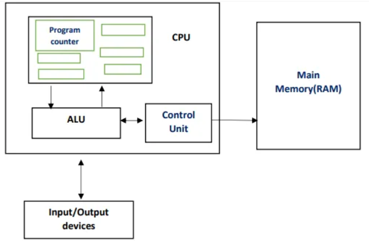
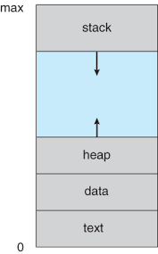
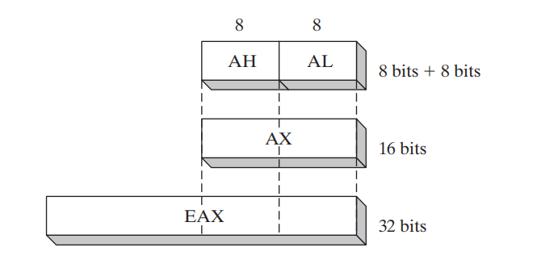
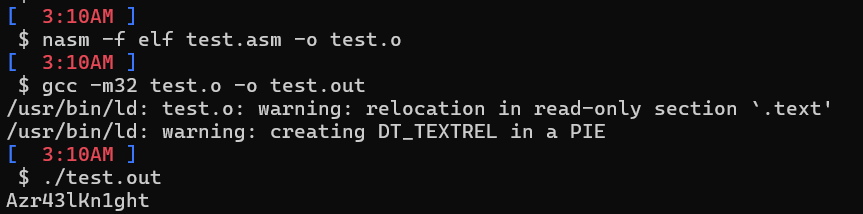

# Malware Development, Analysis and DFIR Series
## PART II 

#### Introduction

In this blog, we will cover the important topics in x86 assembly.

It's not really a languauge, it doesn't have higher level of abstraction or almost no abstraction at all, it's basically machine code that is in human readable form, gives more direct control over the processor, but it indeed requires more writing due to very less abstraction and it's not easily portable.

There are only 3 possible datatypes in the processor level, depending on the number of bytes the processor accesses: Byte(8 bits), Word(16 bits) and Double Word(32 bits).

| Data type in C | Data type in x86 assembly | Size of data type |
| --------       | --------                  | --------          |
|short	         |Word	                     |2 bytes            |
|int             |Double word	             |4 bytes            |
|char            |Byte                       |1 byte             |
|pointers	     |Double word	             |4 bytes            |

Processors or CPU has built-in limited local storage with limited numbers to store and manipulate data during the execution of instructions. The fixed number of registers in x86 are:

|Register|Use|
|---|--------|
|EAX|Extended Accumulator Register|
|EBX|Extended Base Register       |
|ECX|Extended Counter Register    |
|EDX|Extended Data Register       |
|EIP|Extended Instruction Pointer |
|ESI|Extended Source Index        |
|EDI|Extended Destination Index   |
|ESP|Extended Stack Pointer       |
|EBP|Extended Base Pointer        |
|EFLAGS|Extended Flags|

The internals of almost all modern computer architectures including x86 follows the Von Neumann architecture



The CPU is to execute code, main memory is to store the code, data, modules and all required and ALU performs arithmatic operations.

#### Main Memory



The text section contains the code execution.

The data section will contain all static and globally initialised values.

The heap section is where dynamic allocation happens.

The stack is used for local variables and arguments for function calls as well as to help control program flow.


#### Registers

It's the limited memory for working in the processor as they hold values during the computation or execution of instructions. x86 has several general purpose registers and purpose registers. The size of the register depends on the architecture, so it is 32 bit in our case.


#### Let's get into details

There are three types of operands that can be used for an instruction in x86 assembly

Immediate - value used directly.

Register - value stored in register.

Memory address - value stored in a memory address that we get after dereferencing.

There are 4 type of registers

General registers are execution and other operations.

Segment registers are used to track memory sections.

Status flags are used for make decisions.

Instruction pointers are used for tracking next instruction to execute.

|General registers| Segment registers | Status register |Instruction pointer|
| ---------------- | -----------------| ----------------|------------------ |
|EAX (AX, AH, AL) |CS |EFLAGS |EIP|
|EBX (BX, BH, BL) |SS|
|ECX (CX, CH, CL) |DS|
|EDX (DX, DH, DL) |ES|
|EBP (BP) FS|
|ESP (SP) GS|
|ESI (SI)|

General Registers:

Multiplication and division instructions always use EAX and EDX

EAX generally contains the return value after a function call. Hence, if EAX is used right after a function call, the return value is playing a vital role.



Flags:

EFLAGS is 32 bit in size as other other x86 registers, but each of its bit is a different flag. few important ones are

ZF The zero flag is 1 when the result of an operation is equal to 0 else it is 0.

CF The carry flag is 1 when the result of an operation is too large or
too small for the destination operand else it is 0.

TF The trap flag is used for debugging. Processor will only execute
one instruction at once if this flag is high.

SF The sign flag is 1 when the result of an operation is negative or
0 when the result is positive. This flag is also set when the most sig-
nificant bit is set after an arithmetic operation.

PF The parity bit is 1 if the least significant 8-bit of the result contains an even number of 1s

Instruction Pointer

EIP - program counter or instruction pointer is a register that contains the memory address of the next instruction to be executed.

#### Stack

It's a LIFO(last in first out) based data structure where we can push value to store and pop. It's more like a stack of vinyls where you can only take the top vinyl to get the next one. It's implemented as a contagious array in memory. push and pop happens by moving an index or a pointer and it always points to the top of the stack and it's called as the stack pointer. The stack point is also a register and it is possible to alter it when needed and one main thing to note is that we have random access to memory but we are limited to push and pop. The x86 architecture has built-in support for a stack mechanism. The register support includes the ESP and EBP registers. ESP is the stack pointer and typically contains a memory address that points to the top of stack. The value of this register changes as items are pushed on and popped off the stack. EBP is the base pointer that stays consistent within a given function, so that the program can use it as a placeholder to keep track of the location of local variables and parameters

#### Instructions

mov - move data into registers or memory

```
 mov destination, source
```

operands surrounded by brackets are treated as memory references to data. if we have [eax] and eax stores an memory address, it dereferences and gives us the value in that particular memory address.

```
register - mov eax, ebx
immediate - mov eax, 0x33
memory - mov eax, [ebx]
memory - mov eax,[0x100ff0]
memory - mov eax, [ebx+esi*2]
```

but mov eax, ebs+esi*8 is invalid if it's not inside the brackets as address dereference

lea - load effective address is used to put a memory address into the destination

lea eax , [ebx+4] is an equivalent to mov eax,ebx+4 but its invalid

let's look into arithmatic instructions

add - addition

```
add destination, source
```

sub - subraction

```
sub destination, source 
```

The subinstruction modifies two important flags - the zero flag and carry flag, The Zero Flag is 1 if the result is zero, and Carry Flag is 1 if the destination is less than the value subtracted.

there is dec and inc for decrementing and incrementing.


```
inc eax
dec eax
```

mul - multiplication but always multiplies eax with value

```
mul source
```

if divides 64 bit across edx and eax.

div - division by the same way but takes it as EDX:EAX to divide by the source

```
div source
```

there are other instructions like and, or, xor, shl and shr.

There are conditionals like cmp and test

if cmp eax, ebx

```
OP            ZF       CF
eax > ebx     0        0
eax = ebx     1        0
eax < ebx     0        1
```

then we have branching statements like jmp that changes the control flow of the program to the specified address.

```
jmp address
```

we also have conditional jumps that follow after a cmp like jz, jnz, jg, jl, etc..

then we have data buffer manipulation instructions like movsx, stosx, stasx, cmpsx, etc.. where x is substituted by b,w or d for byte, word and dword respectively, in these instructions, esi will be the source index and edi will be the destination index, and here ecx will be used for counting. we also have the rep instructions which increments the esi and edi registers and decrements ecx until it becomes 0. 

there are more instructions which can be reffered from any of the intel architecture manuals.

#### Function Calls

The main function or currently executing function calls a function to transfer execution and then returns back once done. 

first let's look into the call instruction

```
It first pushes the Instruction pointer onto the stack which is technically pushing the next instrucion onto the stack

It jumps to the location that we specify
```

This makes it easier for function calls as its easier to return back to the function as return address is pushed onto the stack.

let's see an example which we will compile and run by

```
nasm -f elf test.asm -o test.o
gcc -m32 test.o -o test.out
./test.out
```




Example:

```p
extern printf

section .data
    msg: db "Azr43lKn1ght", 0x0a, 0x00

section .text
global main
main:
    call code
    mov eax, 33
    cmp eax, ebx
    jne exit
    push msg
    call printf
    jmp exit

code:
    mov ebx, 33
    pop eax
    jmp eax
    
exit:
    mov eax,1
    xor ebx,ebx
    int 0x80
```

global keyword is used to make an identifier accessible to the linker.

In C as the linker, it defines _start which is the usual label for the start part of the code and expects a main label as the entry point.

.data section is the section to add inline data that can be referenced in the main code by name in .text section. In our case the name is "msg" which contains the string "Azr43lKn1ght" followed by 0x0a which is newline character "\n" and 0x00 marks the end of a string in C as known. 

identifier with a colon will be a label and used to name location on our code.

The global and the label is the entrypoint of our program and the processor will start the execution from there.

we initialise printf as an external symbol to use.

then the function code is called and the next intruction is pushed onto the stack by pushing the Instruction pointer.

the exection goes to code as the Instruction pointer is in start of the function code.

it moves 33 into ebx, pop eax which will get us the return address and jump to there gets us back to the main function after the last function call and as mentioned earlier, call pushes next instruction address and not the current call as return back will form a infinite loop!

then eax gets the value 33 and in the next compare, we are checking if eax and ebx are equal, if not execution jumps to exit which calls interrupt with exit status to exit the program.

if they are equal and in our case they are, so the msg is pushed onto the stack to pass it as a parameter to the function and printf is called to print it.

here we can simplify the return from a function using ret instruction.

```
ret instruction - pops the location stored top of the stack and jumping to it, where function call is done and it returns to the next instruction of the caller function.
```

but what if we push something onto the stack!, the return will take us to a different address and function flow is messed up or we will get a invalid memory location error.

to return to location that should be on top of the stack and that is the return address, we have to preserve the stack's layout.

This can be done by use the base pointer and the stack pointer.

```p
extern printf

section .data
    msg: db "Azr43lKn1ght", 0x0a, 0x00

section .text
global main
main:
    call code
    mov eax, 33
    cmp eax, ebx
    jne exit
    push msg
    call printf
    jmp exit
    
code:
    mov ebp, esp
    sub esp, 0
    mov ebx, 33
    mov esp,ebp   
    ret
    
exit:
    mov eax,1
    xor ebx,ebx
    int 0x80
```

mov ebp,esp holds where the top of the stack is. Then subracting esp to allocate space to use on the stack.

The final mov esp,ebp to demolish the function stack, deallocate the allocated space and restore stack to its state it was when function call happened.

But here we alter ebp which makes us lose the old base pointer of the caller function, which will compeletely mess up our program.

so we do this.

```p
extern printf

section .data
    msg: db "Azr43lKn1ght", 0x0a, 0x00

section .text
global main
main:
    call code
    mov eax, 33
    cmp eax, ebx
    jne exit
    push msg
    call printf
    jmp exit
    
code:
    push ebp
    mov ebp, esp
    sub esp, 0
    mov ebx, 33
    mov esp,ebp
    pop ebp
    ret
    
exit:
    mov eax,1
    xor ebx,ebx
    int 0x80
```

here we preserve the old ebp and restore it at the end of the function by push and pop on the stack.

functions contain a common few lines of code at the start of the function called as the prologue. The prologue makes usage of stack and registers easier within the function.

for the above example, the prologue is

```p
    push ebp
    mov ebp, esp
    sub esp, 0
```

in the same way in the end of the function called as an epilogue which restores the stack and registers to their state before the function was called.

for the ablove example, the epilogue is

```p
    mov esp,ebp
    pop ebp
    ret
```

So here the stack frame on the main stack will be more like

```
 Lower Memory Address
  
|                     | 
|_____________________|
| Current stack frame |
|---------------------|
| Caller stack frame  |
|_____________________|
|      Caller's       |
| Caller's stack frame|
|_____________________|

 Higher Memory Address
```

now let's look into passing arguments to the function, the normal method is cdecl.

here function
```cpp
int func(int a, int b , int c)
```

it is done by

```p
push c
push b
push a
call func
```

The parameters are pushed onto the stack from right to left. And in cdecl, the caller function is responsible to restore the stack to old state or remove the pushed parameters.

cdecl is not the only method used and several compilers use several different ways like fastcall,stdcall,etc..

#### Wrapping up

We looked into x86 assembly, basic instructions, function calls, calling conventions, etc.., in the next post, we will look into more DFIR and Malware Analysis! I will also make an another post for x86_64 assembly and it's changes from x86 assembly

#### Contact me?
Azr43lKn1ght | [twitter](https://twitter.com/Azr43lKn1ght) | [Linkedin](https://www.linkedin.com/in/azr43lkn1ght?utm_source=share&utm_campaign=share_via&utm_content=profile&utm_medium=android_app) | [github](https://github.com/Azr43lKn1ght)


