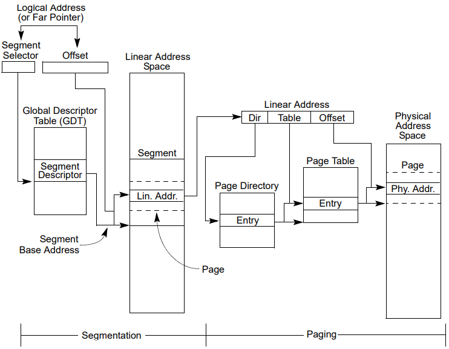
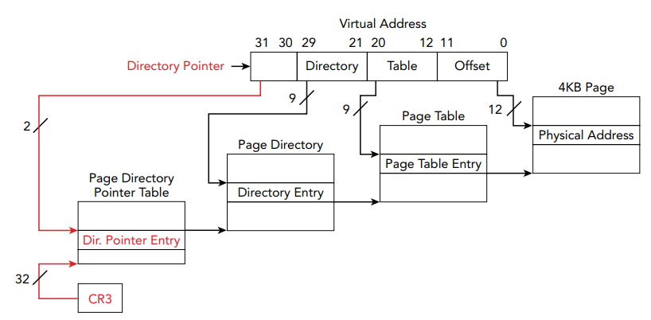
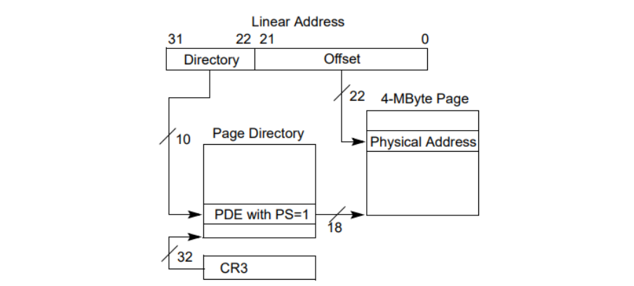
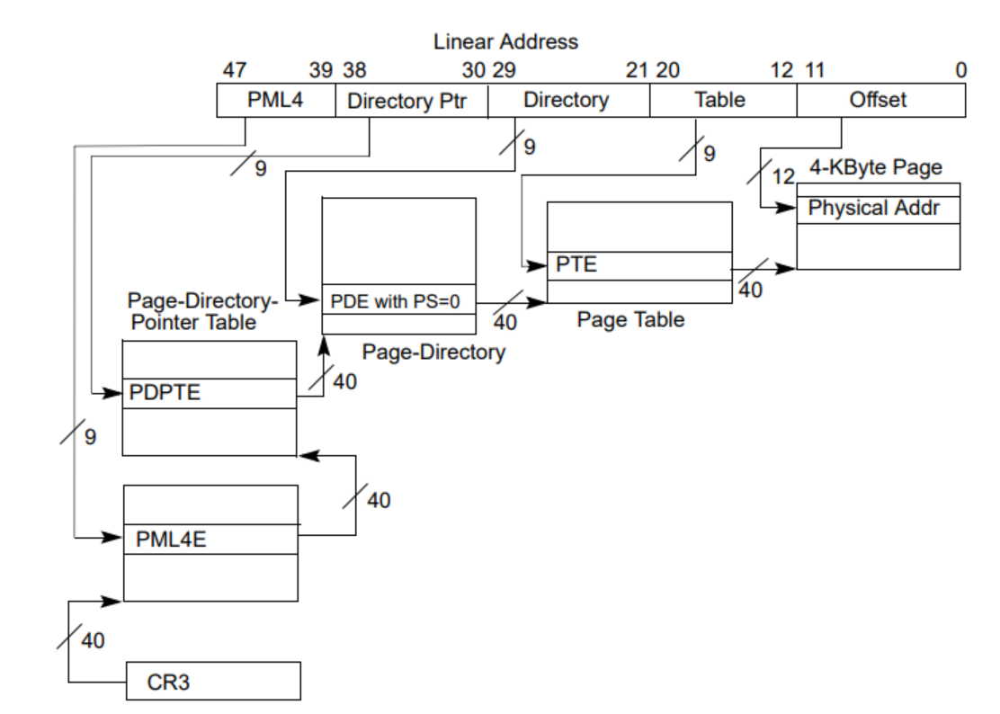
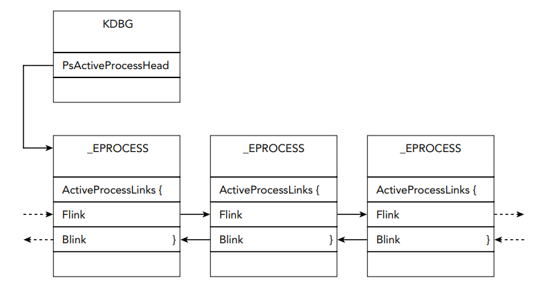
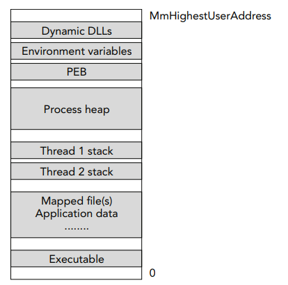

# Malware Development, Analysis and DFIR Series
## PART III 

### Introduction

In this post, we will delve into windows memory internals, understand how memory is managed in windows as well as process internals. we wil also look into segmentation and its role in x86 memory address translation and why as well how it is ignored in x86_64.

First, Let's discuss about the three fundamental memory models which are linear or flat, physical and segmented memory models and with this we have three modes of operation for the processor which are real mode, protected mode and System Management Mode (SMM).

### Memory Models


#### Physical model

This model is where we are able write directly to the physical memory that is the RAM itself and exactly why it does not have any protection mechanisms and due to this if we run out of memory, the system will crash.

#### Flat/Linear model

This model makes use of the concept of virtual memory. In this, the address space is a single contiguous address space and the operating system is responsible for mapping the virtual address to the physical address.

#### Segmented model

This model builds upon the linear model by dividing the linear address space into distinct regions called segments. Here each address is represented by combining effective address and base address of a segment. The base address is stored in a special register called as the segment selector and the effective address is an offset into the segment referenced by the segment selector. 

#### Paging model

This model builds upon the flat/linear and segmented memory model. The operating system divides both physical memory (RAM) and logical memory (process address space) into fixed-size blocks called pages. These pages have the same size for both physical and logical memory. Despite Windows using a segmented memory mode, the details of the process address space are abstracted away from the developer. We will look deeper into it after few more basics.


### Memory Modes

#### Real Mode

It is the first mode in which the processor is in when the computer first boots and which is before the operating system has been loaded. This then implements the segmented memory model and there is very limited memory protections and which makes it very easy to corrupt the system in this mode.Since the address space is limited to 20 bits and thus only 1MB of RAM is addressable. And each virtual address is split into two distinct parts: a 16-bit segment selector and a 16-bit offset. As we already discussed, the segment selector refers to the base address of the segment and the offset is the effective address which is used to index into that segment. This is then used to map to a physical memory address which is the RAM.


In real mode, the size of each register is limited to 16 bits. So most registers that are available in successor modes are not available. There are few register to note down including the segment registers as they are the most important ones when we use segmented memory model:

<> CS (Code Segment): Holds the starting address of the currently executing code segment.

<> DS (Data Segment): Points to the beginning of the currently used data segment. Most memory accesses for data operands use DS.

<> SS (Stack Segment): Defines the starting address of the stack segment.

<> ES (Extra Segment): Provides an additional segment register for programmers to use for various purposes.

<> GS and FS segments: Have no special meaning and are used by operating system as it so wishes but On Windows x86_64, the GS segment is used to store the base address of the thread environment block(TEB).

<> There are pointer registers, which are used to store the effective address (offsets) for a particular segment.

<> IP (Instruction Pointer): Holds the address of the currently executing instruction and is used in conjunction with the code segment.

<> SP (Stack Pointer): Holds the address of the top of the current stack frame and is thus used with the data segment.

<> BP (Base Pointer): Points to the bottom of the current stack frame and is used with the stack segment.

#### Protected Mode


This is where the Segmented memory model is used but with paging added to it and provides additional meticulous memory protection. In 64 bit systems, this is extended further with the introduction of Long Mode. Long Mode sets the base address of all the segment registers (excluding GS and FS) to 0, which states that the address space is flat. let's look into segmented protected mode without paging first.

The previously mentioned registers are no longer are used for address mapping to physical memory. Rather in x86 we have two registers which are:

global descriptor table register (GDTR): Contains the base address for the global descriptor table(GDT), each entry in the table is a segment descriptor which is used to describe a particular segment in the linear address space. The segment selector registers are used to index into the global descriptor table (GDT).

local descriptor table register (LDTR): It is not used on Windows so it is not discussed further.

The Segment selector stays 16 bit as in real mode but the effective address is extended to 32 bits instead. Base address is taken from the segment descriptor and combined with the effective address and the linear address is 32-bits, This is the reason why x86 operating systems are able to address up to 4GB of RAM.


#### System Management Mode (SMM)

System Management Mode (SMM), also sometimes referred to as ring-2 (due to its privilege level),  is a special operating mode found in x86 processors. It's designed for low-level system management tasks handled by the firmware (BIOS or UEFI) and not by the operating system itself.

### Memory Management

#### Virtual Memory

Virtual memory lets processes see a private, continuous memory space even with limited physical RAM. Programs can access the entire virtual address space as if everything is resident, but inactive pages are stored on disk. The memory manager and MMU work together to translate virtual addresses into physical addresses and handle page faults when needed. This creates a separation between the logical memory view and the physical memory reality. The virtual address space is typically divided between the operating system (kernel) and individual processes. Hardware support ensures memory isolation, preventing processes from interfering with each other's memory.

#### Segmentation

Intel IA-32 processors use segmentation for memory management. This divides the memory into variable-sized segments, each with its own descriptor defining location, size, and access permissions. Programs reference memory using a segment selector and an offset within that segment. The processor translates this into a physical address using the descriptor information.

While segmentation offers some advantages, modern operating systems typically create overlapping segments with a base address of zero. This effectively hides segmentation from programs and creates the illusion of a flat, continuous memory space. However, segmentation controls are still enforced for security, requiring separate segment descriptors for code and data access.

#### Paging


Imagine a computer system with limited physical memory but the need to run programs that require much more. Paging comes to the rescue, creating a virtual address space that feels vast and contiguous to programs, even though it's backed by a combination of physical RAM and disk storage. This technique breaks the 32-bit linear address space into fixed-sized chunks called pages. These pages can be loaded into physical memory in any order, providing flexibility and efficient memory utilization.

When a program tries to access a memory location, the address goes through a translation process. Special tables called page directories and page tables, stored in memory, act as a map for this translation. The page directory is like a main directory in a library, holding references to sub-directories (page tables). A special register (CR3) points to the page directory. To find the specific page directory entry (PDE) for the target memory location, the processor combines bits 31:12 from CR3 with bits 31:22 of the virtual address.

Each page directory entry points to a page table, which lists individual pages. Page tables reside in memory and are accessed using the PDE. Bits 31:12 from the PDE are combined with bits 21:12 of the virtual address to locate the relevant page table entry (PTE) for the specific page. Think of it like finding a specific book in the library using the sub-directory information. Finally, the MMU (Memory Management Unit) retrieves the physical frame number from the PTE and combines it with the remaining bits (11:0) of the virtual address to obtain the final physical address in memory. This physical address points to the actual location of the data in RAM.

Paging offers several benefits. By loading only actively used program sections (pages) into memory, the operating system can manage memory efficiently. Programs can operate under the illusion of having a large, contiguous memory space, simplifying memory management for developers. Additionally, paging enhances security and stability by allowing the operating system to control access permissions in the page tables, preventing processes from accessing each other's memory.



#### Demand Paging

Demand paging is a key technique for virtual memory. It avoids loading entire processes into memory at once. Instead, it brings in only the pages that are actively being used, relying on the principle of locality of reference (frequently accessed memory locations tend to be clustered). This reduces memory load time and allows more processes to run concurrently. The operating system tracks which pages are in memory and triggers a "page fault" when a non-resident page is accessed. The OS then retrieves the needed page from the swap file (on disk) and handles the fault. Demand paging improves system performance and is invisible to running applications. However, it adds complexity to memory forensics because some data might reside on disk during memory analysis. In some cases, combining data from memory and disk can provide a more complete picture of virtual memory.

#### Shared Memory

Shared memory is a feature in modern operating systems that allows processes to access the same memory region from their own virtual address spaces. Imagine two programs, A and B, having private memory spaces that overlap in a certain area. This overlap signifies that both programs are mapped to the same physical memory pages. This shared memory area provides a fast and efficient way for processes to communicate and exchange data, eliminating the need for slower methods like message passing.

Shared memory also helps conserve physical memory. Instead of each process having its own copy of frequently used data (like libraries), a single instance can be shared across processes. This reduces overall memory usage. Operating systems often employ a "copy-on-write" strategy for shared memory. Initially, processes share the same physical pages. If a process tries to modify the shared data, the memory manager creates a private copy of the page specifically for that process. This ensures data integrity for individual processes while optimizing memory usage. Shared memory and copy-on-write techniques are important for memory forensics. Since malicious software might exploit shared memory to alter program execution (e.g., modifying shared libraries).

### Address Translation



The linear address on x86 systems is divided into three distinct parts: 

```
- Page Directory index
- Page Table Index
- Byte Offset 
```

This gives a three-level paging structure. Each page on a x86 system is either 4KB or considered a large page which comprises of a 4MB page, these large pages are only enabled if the page size extension (PSE) bit is enabled in the CR4 register. The only distinguishable difference between the two, is that a large page address does not have a page table index and its offset is extended from 12-bit to 22-bits.

The same applies to x86_64 systems but since physical address extension (PAE) is enabled by default in order to increase the addressable amount of memory, the linear address changes slightly and is extended but usually limited to 48 bits on most operating systems to make paging simpler to manage. This provides a paging hierarchy of four levels. 

In x86, the page directory index is 10 bits; the page table index is 10 bits and the byte offset is 12 bits. The page directory index – as the name implies – contains an index into the page directory which is an array of page directory entries (PDEs). The page directory differs between different processes but the physical address can always be found in the CR3 register. The page directory consists of 1024 page directory entries, all of which are 32 bits (4 bytes) in length. Each page directory entry will point to a page table which in turn consists of 1024 4-byte entries known as page table entries (PTEs). This PTE is very similar to a PDE but instead of referring to a page table, will point to the base physical address of the associated page; the page offset is then applied to this base address to find the physical address which the PTE corresponds to.


The above figure is for 4kb pages.


The above figure is for 4mb pages.

in x86_64, the linear address being 64-bits in length, only 48-bits of that linear address is addressable by the operating system! This restriction means that all addresses on must be canonical: the upper 14-bits must be either all 0s or all 1s. The 48th bit (bit 47) determines what the other upper bits will be set to: if it is set to 1, then the rest must be 1s otherwise the rest must be 0s if it has been set to 0.

The linear address is then broken in the following parts:

```
- 14-bit sign extension 
- 9-bit page-map level-4 offset (PML4) 
- 9-bit page directory pointer index (PDPT)
- 9-bit page directory index (PDE)
- 9-bit page table index (PTE) 
- 12-bit byte offset.
```


above image is for 4kb paging for 4 level paging.

The CR3 register no longer references the physical address of a page directory but rather the physical address of the PML4 table instead, specifically, the bits 12 to 51 of the CR3 register are used. All the paging tables now store 512 entries each respectively, with each entry being extended to 64 bits (8 bytes), although, only 40 bits is actually used for indexing into the other tables. The DirectoryTableBase field of the _EPROCESS structure now refers to the PML4 rather than the page directory table.

The PML4 table consists of 512 PML4 entries, the PML4 index from the linear address is multiplied by 8 bytes – remember each PML4E is 8 bytes in length – and then added to the base address found in the CR3 register. This means that the PML4 table can address up to 512GB of physical memory. Similarly, bits 12-51 of the PML4E contain the physical address of a PDPT, we use the same process as before to find the PDPTE: take the index into the PDPT from the linear address then multiply by 8 bytes, which when combined with the physical address allows us to locate the corresponding PDPTE. This maps up to 1GB of physical memory.

To find the address of the page directory table entry, we take the PDE index multiply that by 8 bytes then use that with bits 12-51 of the PDPTE. This is assuming that the PS flag (bit 7) of the PDPTE has been set to 0. If the flag were to be set to 1, then we would use combine bits 30-51 and bits 0-29 from the linear address in order to find the physical address. This only applies to 1GB pages. And in the more common case, the PS flag will be set to 0, and the PDE will be used to find the corresponding PTE using a similar process. If the PS flag were to be set to 1, then the PDE would point to a large page (2MB) directly.


The above image is for 2mb paging for 4 level paging.

### Process Internals


At the center is the _EPROCESS, which is the name of the structure that Windows uses to represent a process. Although the structure names certainly differ among different operating systems share the same concepts that are described in this high-level diagram. They all have one or more threads that execute code, and they all have a table of handles to kernel objects such as files, network sockets, and mutexes. Each process has its own private virtual memory space that’s isolated from other processes. Inside this memory space, you can find the process executable, its list of loaded modules, and its stacks, heaps, and allocated memory regions containing everything from user input to application-specific data structures. each _EPROCESS points to a list of security identifiers and privilege data. This is one of the primary ways the kernel enforces security and access control

The _EPROCESS structure contains a _LIST_ENTRY structure called ActiveProcessLinks. The _LIST_ENTRY structure contains two members: a Flink (forward link) that points to the _LIST_ENTRY of the next _EPROCESS structure, and the Blink (backward link) that points to the _LIST_ENTRY of the previous _EPROCESS structure.



#### Process Environment Block (PEB)

_EPROCESS contains a pointer to the Process Environment Block (PEB). Although the member (_EPROCESS.Peb) exists in kernel mode, it points to an address in user mode. The PEB contains pointers to the process’s DLL lists, current working directory, command line arguments, environment variables, heaps, and standard handles.

#### Process Control Bloack(PCB)

The kernel’s process control block (_KPROCESS). This structure is found at the base of _EPROCESS and contains several critical fields, including the DirectoryTableBase for address translation and the amount of time the process has spent in kernel mode and user mode. 

#### Process Tokens

A process’s token describes its security context. This context includes security identifiers (SIDs) of users or groups that the process is running as and the various privileges (specific tasks) that it is allowed to perform.

A process’s token contains numerical SID values that you can translate into a string and then resolve into a user or group name. This ultimately enables you to determine the primary user account under which a process is running

When the kernel needs to decide whether a process can access an object or call a particular API, it consults data in the process’s token. As a result, this structure dictates many of the security-related controls that involve processes.

#### Process Handles

A handle is a reference to an open instance of a kernel object, such as a file, registry key, mutex, process, or thread. By enumerating and analyzing the specific objects a process is accessing or has handles to, we can predict what process was reading or writing a particular file, what process accessed one of the registry keys, and which process mapped remote file systems. For a process to access an object, it must open a handle to the object by calling WinAPI that helps us such as CreateFile, RegOpenKeyEx, or CreateMutex. These APIs return a special Windows data type called HANDLE, which is simply an index into a process-specific handle table. 

if we use CreateFile, a pointer to the corresponding _FILE_OBJECT in kernel memory is placed in the first available slot in the calling process’s handle table, and the respective index (such as 0x40) is returned. So normally Read or Write is done by

```
- Finding the base address of the calling process’s handle table
- Go to index of the handle
- Retrieve the _FILE_OBJECT pointer from the table
- Proceed with the read or write operation
```

#### Process Threads

A thread is the basic unit of CPU utilization and execution. A thread is often characterized by a thread ID, CPU register set, and execution stack(s), which help define a thread’s execution context. A process with multiple threads can appear to be simultaneously performing multiple tasks.

#### Process Memory Layout



The positions as well as it's ranges are not constant especially in the case of ASLR (Address Space Layout Randomization). The thread stacks can exist below or above the process executable, or the ranges containing mapped files can be interspersed throughout the entire process space, not gathered contiguously.


<> DLLs:  shared libraries (DLLs) that were loaded into the address space, either intentionally by the process or forcefully 
through DLL injection.

<> Environment variables: This range of memory stores the process’s environment variables, such as its executable paths, temporary directories, home folders, etc..

<> Process Environment Block(PEB): Contains the process’s command line arguments, its current working directory, and its standard handles as well as location to several of the other items in this list, including the DLLs, heaps, and environment variables.

<> Process heaps: Where you can find a majority of the dynamic input that the process receives.

<> Thread stacks: Each thread has a dedicated range of process memory set aside for its runtime stack. This is where you can find function arguments, return addresses, local variables, etc..

<> Mapped files and application data: Mapped files represent content from files on disk, which could be configuration data, documents,etc, Application data is anything the process needs to perform its intended duties.

<> Executable: The process executable contains the primary body of code and read/write variables for the application. This data may be compressed/encrypted/packed/crypted on disk, but once loaded into memory, it unpacks, enabling you to dump original/relaible code back to disk.

#### Process Page Tables

we can leverage page tables to map virtual addresses in process memory to physical offsets in RAM, determine what pages are swapped to disk, and analyze the hardware-based permissions applied to the pages.

#### Virtual Address Descriptor(VAD)

VADs are structures defined by Windows to track reserved or committed, virtually contiguous collections of pages. If a page is 4KB and a process commits 10 pages at the same time, a VAD is created in kernel memory that describes the 40KB range of memory. If the region contains a memory-mapped file, the VAD also stores information about the file’s path.

A process’s VAD tree describes the layout of its memory segments at a slightly higher level than the page tables. The operating system defines and maintains these data structures. VADs contain the names of memory-mapped files, the total number of pages in the region, the initial protection (read, write, execute), and several other flags that can tell you a lot about what type of data the regions contain.

### Conclusion

In this post, we have discussed the three fundamental memory models which are linear or flat, physical and segmented memory models and with this we have three modes of operation for the processor which are real mode, protected mode and System Management Mode (SMM). We have also discussed about the memory management in windows and how the address translation is done in x86 and x86_64 systems. We have also discussed about the process internals and how the memory layout is done in a process.

### Contact me?
Azr43lKn1ght | [twitter](https://twitter.com/Azr43lKn1ght) | [Linkedin](https://www.linkedin.com/in/azr43lkn1ght?utm_source=share&utm_campaign=share_via&utm_content=profile&utm_medium=android_app) | [github](https://github.com/Azr43lKn1ght)

#### References

- The Art of Memory Forensics,
- Microsoft Windows Internals and MSDN,
- The Malware Cookbook,
- bsodtutorials,
- Practical Malware Analysis,
- sysforensics,
- volatility Labs.