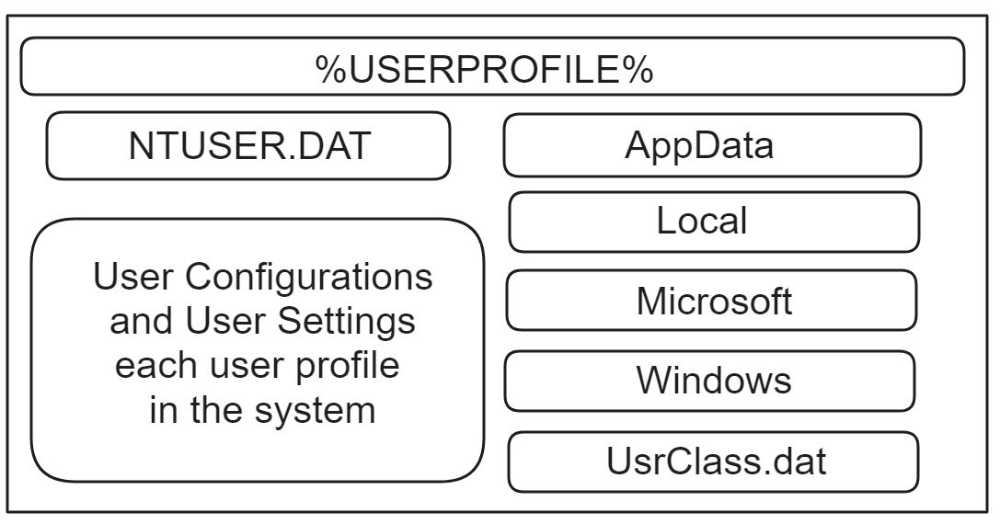
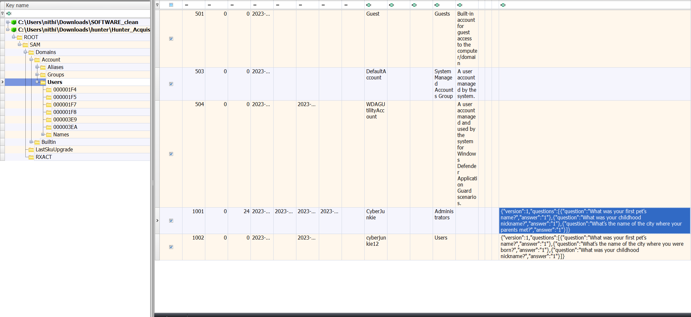

# Malware Development, Analysis and DFIR Series
## PART IV

### Introduction

In this post, we will start with the essentials of windows forensics, understand windows filesystems and artefacts that are important for Digital Forensics and Incident Response (DFIR) investigations. Windows forensics is crucial for investigating malware attacks, responding to incidents, hunting anomalies, recovering data, ensuring compliance, conducting internal investigations, enhancing security, performing digital audits, and gathering threat intelligence.


### Windows FileSystems

A filesystem is essential for organizing, managing, and storing data on a computer, facilitating efficient data retrieval and management. It provides a structured framework to arrange data into files and directories, simplifying access and manipulation for users and applications. Filesystems handle the allocation of storage space, track file locations, and ensure data integrity and security through permissions and access controls. Without a filesystem, data would be stored in a chaotic and inaccessible manner, resulting in inefficiencies and potential data loss. Fundamentally, filesystems are vital to the functionality, performance, and reliability of computer systems, ensuring that data is systematically stored and readily accessible.

Windows has used different file systems in its history of existence, File Allocation Table (FAT) filesystem was created to be used on floppy disks in 1977 and it has no security features, few timestamps, and several hacks which made it to be used as a filesystem till date. There are several different versions of FAT which are FAT12, FAT16, FAT32, and exFAT. The major difference in between them is the size of addressable entries in file allocation table (FAT), which determines the maximum volume size.


The NTFS (New Technology File System) is an advanced filesystem developed by Microsoft in 1993, essential for the Windows operating system. It offers robust features such as support for large volumes, enhanced file security, data compression, and encryption, which are critical for both personal and enterprise environments.

NTFS had several features that made it more secure and reliable than FAT filesystems, such as:

```
<> Reduced Fragmentation of data
<> Filesnames with mixed cases and more than 255 characters
<> Transaction journaling when crash recovery
<> compression, encryption, and quota enforcement support at the filesystem level
<> support for sparse files, hard links, soft links, and reparse points
<> extent-based allocation for large files
<> smaller cluster sizes for efficient storage
<> support for alternate data streams
<> POSIX support and etc.. 
```
some interesting features of NTFS are:

<> log file to record changes to the metadata to track the state and integrity of the filesystem which is either called as journaling or transaction logging. Tracking all the files that have changed on the system via a USN (Update Sequence Number) Journal or Change Journal.

<> POSIX compliance and support for hard links and soft links which is single file with multiple names and linkers to files.

<> Object ID to track files and directories even if they are moved or renamed.

<> Security feature that enables privellege separation and access control lists (ACLs) to restrict access to files and directories.

<> Volume backups using Volume Shadow Copy feature.


let's have a different post for filesystems and partitions in windows later and move on to the artefacts that are important for DFIR investigations.

### Windows Registry

The registry is a collection of database files that store vital configuration data for the system. It stores software, hardware, and system component information. The registry can detail the software that has been installed, system configuration, recently used files, and startup programs. The registry can be viewed and manipulated using "regedit.exe." The best tool to use while analysing hives in my opinion is [registry explorer](https://f001.backblazeb2.com/file/EricZimmermanTools/net6/RegistryExplorer.zip) by Eric Zimmerman.


```
The registry has four root keys:
HKEY CLASSES ROOT- - HKCR
HKEY CURRENT USER- - HKCU
HKEY LOCAL MACHINE- - HKLM
HKEY USERS- - HKU
```

The registry can be accessed either on a live system or offline. If offline, you will need to know where the registry files are stored. The majority of the files are stored under the [OS drive]\windows\system32\config directory. These registry hives are DEFAULT, SAM, SECURITY, SOFTWARE, and SYSTEM. 

The files correspond to their meaning in the registry. All of these system files would reside under the HKEY_LOCAL_MACHINE hive under their sub-meaning SAM, SECURITY, SOFTWARE, and SYSTEM. The HKEY_LOCAL_MACHINE contains the system setup, startup files, machine configuration, and other default files.


The SYSTEM hive stores the HKEY_LOCAL_MACHINE\SYSTEM including hardware and service configuration. It will also list the majority of the raw device names for volumes and drives on the system including USB keys.

The SOFTWARE hive stores data from the HKEY_LOCAL_MACHINE\SOFTWARE, which is where all the settings for applications are found. Windows programs/products also have their settings stored here.

The NTUSER.DAT hive contains the configuration and environment settings, which includes a slew of identifiable data pertaining to user activity.

The SAM hive contains all the local user accounts and groups. It is found on your system at HKEY_LOCAL_MACHINE\SAM .

The SECURITY hive contains all the security information that is utilised by the SAM and the operating system including password policies, membership of group information, and more.

The AMCACHE.HVE was added to Windows 7 through updates though it was introduced in windows 8 first . This hive is utilised for the internal application compatibility capability that allows for Windows to run older executables found from earlier iterations of their operating systems. This hive file is utilised for tracking evidence of execution. This is more like PCA(artefact only in windows 11 for a similar purpose)


Backup registry hives are created every 10 days, the RegIdleBackup scheduled task will run. It will copy the SAM, DEFAULT, SYSTEM, SOFTWARE, and SECURITY hives into the  %windows%\System32\Config\RegBack\backup directory

Along with core System hives, each user have a set of registry hives. These hive store configuration data for application and settings of the respective user. The registry hives can be used to enumerate the most recently used files. It can also show you the last files that the user searched for on the hard drive. It can also show the last typed URLs that the user did input into his browser window. It can also show the last commands executed on the system as well as the files that were opened. You can also witness which files were last saved to the Windows system.



The NTUSER.dat hive contains all the keys related to the specific user.

There is an additional hive that was added from windows 7 and located at C:\Users\<username>\AppData\Local\Microsoft\Windows\UsrClass.dat. This hive is very important because it contains some key information regarding additional program execution information and will give us the ability to tell which folders a user has opened or closed.

The UsrClass.dat's main purpose is to aid in the virtualized registry root for User Account Control (UAC). A key exists for every registered filename extension. The UAC virtualized registry is found in the VirtualStore key.

Registry hives on a live, powered on machine look much different than they would when you analyse it offline. Most beginners, when reading up on the registry hives online, will encounter their formal names.

```
HKEY_LOCAL_MACHINE\<System\Software\Security\SAM>
HKEY_USER or HKEY_CURRENT_USER
```

These are commonly found when regedit is used, and someone can easily open up the HKEY_LOCAL_MACHINE key and see the subkeys, which include our four main hive files (System, Security, Software and SAM) from the %windir%\System32\config directory. for easier usage, we shorten HKEY_LOCAL_MACHINE to HKLM when written. When you are analysing a user's hive, you are usually browsing to HKEY_ USER (if more than one user is logged in) or HKEY_CURRENT_USER (the currently logged in user).

#### Registry Keys/Value pairs:

```
• Keys - Similar to Folders (keys) and subfolders (subkeys)
         Produces a folder/directory hierarchy
• Values - Data stored within a key
         Contain Data in form of: Strings, binary data, integers, lists, hexadecimal
         This is where the most valuable data is found
```

Registry keys are similar to file folders in a file system. They can contain subkeys (subfolders) and values (files). Usually when you write the location of a registry key, you would write the full key so it can be located easily. One of the things that will help out the investigator greatly will be the fact that each registry key will have a last write time or last time of modification. This is useful to know when a value changes within a key, and it contains something that is pertinent to the case and we can map that time to other activity that was occurring on the system.


The last write time is tracked for every key on the system. A timestamp of the last update of any of the key values will be stored which is usually displayed in UTC, is very crucial in DFIR investigations. For example, you could see the last time the attacker/victim ran a search for files that contain certain words related to a confidential file that he had given an opposition. Knowing the time that the incident occurred and pairing that data with additional system facts such as when a user was logged on and if the files were moved/copied over to a USB. Always remember, the last write time is updated when a value is updated or added to the key.

#### Hive Transaction Logs

The Windows operating system caches registry writes in two places: in memory and on disk in the transaction log file. The transaction log files, named after the respective hive (e.g., HIVENAME.LOG1 and HIVENAME.LOG2), are located in the same directory as the registry hive file. Starting with Windows 8, Microsoft changed how the system permanently writes to hive files. The transaction log files temporarily cache registry writes before they are permanently written to the hive. A significant change introduced in Windows 8.1 and later versions means that recent activity from the past hour may remain in the transaction log files and not be reflected in the registry hive file unless the transaction log files are parsed when opening the registry hive file.


This anomaly warrants further exploration. When the Windows operating system modifies a key or value in a registry hive file, the changes first occur in memory. Writing these changes to disk is known as a "hive flush." From Windows 8 onwards, temporary data is written to transaction log files, which continually append these logs. Permanent writes to the core hive file do not happen immediately but occur during periods of inactivity, system shutdown, or after an hour has passed since the last write to the primary hive file. This change has reduced disk writes over time, thereby improving the operating system's performance by minimizing continuous registry hive writes.

This has significant forensic implications. Recent registry changes are likely to be found in the transaction log files rather than the hive files under examination. Most registry forensic tools do not check or alert users to this issue. This is particularly relevant when tracking recent user or process interactions within the Windows operating system. Many forensic tools overlook the data stored in transaction log files, especially on Windows 8 systems, potentially missing recent system changes. However, other artifacts can still be relied upon.

#### MRU Lists

“Most Recently Used” (MRU) lists are responsible for the drop-down menus that appear whenever you type something in Internet Explorer, keywords, and other terms handled by the AutoComplete feature.

In the registry, MRULists are key values that keep track of the most recent additions to a registry key, allowing the key data to determine the order in which entries were added. While this can be used internally for various purposes within the Microsoft operating system, it is particularly useful in DFIR.

#### Deleted Registry


Similar to file systems, registry hives contain free and allocated data areas. When a registry key is deleted, it is merely unallocated, much like a file, making it recoverable with forensic tools. There are various reasons someone might want to recover deleted keys. Often, deleted keys result from using privacy cleaners, uninstalling programs, and clearing browser history. Many valuable artifacts for case data can be found in deleted registry keys, as more advanced users/atackers may attempt to cover their tracks on a typical Windows operating system.


#### User Information

Profiling a user is critically important in a case. It is useful to know how often a user has logged onto a specific machine, the last login time, the last failed login, and the password policy. Additionally, many programs, such as the Recycle Bin, use the user's RID (Relative Identifier) instead of the username. It's essential to understand how to locate this information on a machine during an investigation.

```
On a multi-user system, how can we map a RID back to the original user if we have only a disk image to examine?
```

We can examine the SAM registry hive where the accounts are managed to see which user is mapped to which RID and answer all the above questions. All you need to do is import the SAM hive into your Registry Explorer and examine the contents.

#### SAM

The first place we will look for information is the SAM hive. The SAM hive helps us enumerate all the users with profiles on the machine. If your machine is part of a domain, the SAM file containing user profiles will be located on the Domain Controller.

Tying a Username to a RID (Relative Identifier):

Many artifacts on a Windows machine point back to a user's RID rather than their username. Understanding this connection is crucial for various forensic analysis.

Profiling the User:

Profiling a user based on their login habits and mistakes is incredibly important. You can easily determine the last login of each user and the total number of logins they have made. Both pieces of information are valuable as they indicate how active a specific user might be on the machine. Note that the last login count will not increment if a Microsoft account is used; however, it will still increment for a local (non-Microsoft) account.

```
Account Usage (SAM)
Account Created
Last Login
Last Failed Login
Last Password Change
Group Membership
```

One another thing that is very useful from SAM is that user logon authentication security questions are stored in plaintext. It is stored in SAM/Domains/Account/Users



There is also a Challenge from bi0sctf called as "Verboten" which helps you practice this as well as several windows forensic artefacts. Writeup for Verboten if you need to it check out : [Verboten Writeup](https://blog.bi0s.in/2024/03/08/Forensics/verboten-bi0sCTF2024/)

#### System Configuration


#### Windows OS Version

The version of the Windows OS is critical for accurately finding and utilizing the correct artifacts during your analysis. Directory paths, types of artifacts, and even default programs vary based on the version and service pack of the Windows OS. Knowing the OS version also helps save time when profiling memory in Volatility using imageinfo.

You can find this information in the SOFTWARE hive at the following key: SOFTWARE\Microsoft\Windows NT\CurrentVersion. This key provides details about the specific Windows OS, service pack, and install date of the machine you are investigating. Notably, the install date is one of the few dates that do not follow the standard 64-bit Windows time format; instead, it is in Epoch time.


#### Identifying Current Control Set

What is a Control Set?, A control set contains system configuration settings needed to control system boot, such as driver and service information.

Why Are There Typically Two Control Sets (ControlSet001 and ControlSet002)?, ControlSet001 is usually the control set that you just booted into the computer with, representing the most up-to-date version.

ControlSet002 is the "Last Known Good" version, which is the configuration considered good during the previous boot. This version is kept in case something goes wrong during the current boot cycle.

When examining a ControlSet on a non-active machine, ControlSet001 represents the last successful boot, and ControlSet002 represents the previous successful boot before that.

When opening a SYSTEM hive, you will typically see two registry paths for ControlSets: ControlSet001 and ControlSet002. To determine which of these represents the volatile hive "CurrentControlSet," you need to examine the Select key. If the current key value is set to 0x1, it corresponds to ControlSet001, and vice versa.  

#### Computer Name

Computer Name is helpful in maping system in logs, network activities,etc.., It is useful mainly for logging purposes and verification, but it should not go unnoticed. The computer name's location is in the SYSTEM hive: SYSTEM\CurrentControlSet\Control\ComputerName\ComputerName


#### Time Zone Information

Although most registry times and last write times are recorded in UTC, the system’s log files and other time-based information are tied to the specific time zone. For example, file system timestamps on FAT file systems are updated according to the local time zone set in the control panel applet. A user can easily change the time zone. The last write time to this key will show the last time the time zone was changed for this machine.

This will also  show the last time the time zone was changed on the machine. It is highly recommended to set your local analysis machine time to UTC to avoid any bias that could be accidentally introduced by a forensic tool, potentially leading to the misinterpretation of time-related data.

SYSTEM/CurrentControlSet/Control/TimeZoneInformation

#### NTFS Last Access Time

The last access timestamp is a forensic artifact that requires considerable caution before forming an opinion. It is often incorrectly attributed to the last time a file was "opened" when, in fact, it may also be updated if the file is merely "touched" without being opened.

Definitive statements about a last access timestamp can lead to inaccurate reporting or testimony if an examiner is not careful.

To determine if last access timestamps are being updated on a system you are examining you can examine the following registry key.

SYSTEM\CurrentControlSet\Control\FileSystem


#### Network Interface

Listing the network interfaces is very important. The network interface can be key to many cases and can save you a lot of trouble in the long run.

The key is located in the SYSTEM hive at:

SYSTEM\CurrentControlSet\Services\Tcpip\Parameters\Interfaces

This key contains a wealth of useful information. Specifically, it allows you to see the TCP/IP configuration, the IP address, the gateway, and other potentially useful information. If the machine is configured for DHCP, it will contain the assigned DHCP IP address, the subnet mask, and the DHCP server's IP address.

This information can be incredibly useful for cases involving network-based data. It is considered essential and basic information to be displayed about the machine when compiling a report.

The interface GUID can also be used to correlate additional network profile data obtained from other registry keys. It is useful to document the interfaces and their respective GUIDs during a case to determine exactly how a network was accessed.


#### Network History

Network Location Awareness (NLA) is designed to help users identify where their computer is connected by adjusting the firewall settings appropriately.

NLA also provides unique forensic information. It shows a list of all the networks the machine has ever connected to, identified by their DNS suffix. This is incredibly important for identifying intranets and networks that a computer has connected to.

```
Most info regarding NLA will be stored under the following three places:

HKLM\Software\Microsoft\Windows NT\CurrentVersion\NetworkList

HKLM\Software\Microsoft\Windows\CurrentVersion\HomeGroup

C:\Windows\System32\NetworkList

Historical data can be found under the Cache key:

HKEY_LOCAL_MACHINE\SOFTWARE\Microsoft\Windows 

NT\CurrentVersion\NetworkList\Nla\Cache
```

  
#### Network profiles Key - first/last connection

The key is now located in 

SOFTWARE\Microsoft\Windows NT\CurrentVersion\NetworkList\Profiles.

Each subkey located in this key will contain a GUID that will contain the network name and the network type. The network type will be listed as either 0x47 (hex) for wireless, 0x06 (hex) for wired

Being able to identify the network type will be useful in determining how a user connected to a network name that was defined earlier. Using the ProfileGuid, it is easy to map the Historical Network information with MAC Address and SSID to the correct date and times last connected.

Note: Time here is Local time and not UTC

#### System Boot Autostart Programs

```
NTUSER.DAT\Software\Microsoft\Windows\CurrentVersion\Run
NTUSER.DAT\Software\Microsoft\Windows\CurrentVersion\Run Once
Software\Microsoft\Windows\CurrentVersion\RunOnce
Software\Microsoft\Windows\CurrentVersion\policies\Explorer\Run
Software\Microsoft\Windows\CurrentVersion\Run
```
The above lists programs/applications executed during a user logon event. These are not executed at boot. There is no specific order to the startup, and these keys exist in both the NTUSER.DAT and the SOFTWARE hives.

SYSTEM\CurrentControlSet\Services

If the Start key is set to 0x02, then service will start at boot. For services started at boot, one can check the above key in the SYSTEM hive. One of malware persistence techniques that are often seen in the wild.

#### Shutdown Information

Sometimes, it is necessary to know when the system was last shut down, as well as the number of successful shutdowns. The following keys will be useful:

SYSTEM\CurrentControlSet\Control\Windows (Shutdown Time)


SYSTEM\CurrentControlSet\Control\Watchdog\Display (Shutdown Count)

The last shutdown time can be useful for detecting certain types of activity of the user. The shutdown count also indicates whether the user typically shuts down the machine properly or not.

#### Installed Applications

```
Software\Microsoft\Windows\CurrentVersion\Uninstall
Software\WOW6432Node\Microsoft\Windows\CurrentVersion\Uninstall
Software\Microsoft\Windows\CurrentVersion\App Paths
Software\WOW6432Node\Microsoft\Windows\CurrentVersion\Installer\UserData\SID\Products
NTUSER\Software\Microsoft\Windows\CurrentVersion\Uninstall
NTUSER\WOW6432Node\Software\Microsoft\Windows\CurrentVersion\Uninstall
NTUSER\Software\Microsoft\Windows\CurrentVersion\App Paths
```
These registry keys store information related to installed applications, their paths, and user-specific settings. They are useful for tracking software installation and uninstallation, determining application paths, and understanding user-specific software configurations.

The Uninstall Key gives us information about:

```
<?> Application Name
<?> Application Version
<?> Application File Size
<?> Application Location/Path
<?> Software Publisher
<?> Install Date 
```

These keys are particularly valuable in forensic analysis for understanding software usage, detecting unauthorized installations, and reconstructing user activity on a Windows system.

#### Evidence of User Activity and Execution

```
<?> UserComms
<?> File Download
<?> Program Execution
<?> File Opening/ Creation
<?> File Knowledge
<?> Physical Location
<?> USB Key Usage
<?> Account Usage
<?> Browser Usage
```

#### Wordwheelquery Key

NTUSER.DAT\Software\Microsoft\Windows\CurrentVersion\Explorer\WordWheelQuery

WordwheelQuery will record the historical searches for programs and files on the machine. The search query can be entered in the Start menu or the Explorer Folder view search bar. Being able to know exactly when a specific user looked for an artefact is extremely useful to the investigation.

#### typed paths

NTUSER.DAT\Software\Microsoft\Windows\CurrentVersion\Explorer\TypedPaths

This key records when a path is manually typed into the Start menu or Explorer bar. It is useful in situations where you need to demonstrate that the user had specific knowledge of a location. By showing that the user had to type or cut-and-paste the location into Explorer, it indicates direct knowledge of that location, ruling out accidental navigation by Explorer.

The entries in this key are auto-sorted by most recent usage, with the #1 spot being the most recent. Although there is no MRU (Most Recently Used) key, the paths are kept in order, with the url1 value being the last one added, url2 being the next, and so on.

#### RecentDocs

NTUSER.DAT\Software\Microsoft\Windows\CurrentVersion\Explorer\RecentDocs

This key and its subkeys are extremely valuable for investigating activity related to a specific file. While the raw values of this key may be difficult to read, tools like Registry Explorer can parse the contents for easier viewing.

The values are displayed in MRU (Most Recently Used) list order when viewed through a registry viewer. The MRU list shows the most recently opened file first, with the file opened furthest back in time listed last. This organization makes it easier to track file access activity chronologically.


Microsoft Office RecentDocs:

Each Version of Office Version Found in Registry

NTUSER.DAT\Software\Microsoft\Office\VERSION

NTUSER.DAT\Software\Microsoft\Office\VERSION\UserMRU\LiveID_####\File MRU

#### OpenSaveMRU

This key tracks files that have been opened or saved within a Windows shell dialog box. It includes data from not only web browsers like Internet Explorer and Firefox but also from a majority of commonly used applications. An important detail that is sometimes overlooked is that this key also tracks autocomplete terms for the same dialog box. This can provide valuable insights into user activity across various applications.

The key is located at HKCU\Software\Microsoft\Windows\CurrentVersion\Explorer\ComDlg32\OpenSaveMRU

#### LastVisitedMRU:

HKCU\Software\Microsoft\Windows\CurrentVersion\Explorer\ComDig32\LastVisitedMRU 


This key tracks the specific executable used by an application to open the files documented in the OpenSaveMRU key. Additionally, it records the directory location of the last file accessed by that application. The data is stored in binary format. Ever wonder how an application remembers where you last opened a file from? This key is used by the OpenSave dialog box to display the last directory used by that application when you attempt to open or save a file. It maintains its own MRU (Most Recently Used) list and last write time.

#### Last Commands Executed

```
HKCU\Software\Microsoft\Windows\CurrentVersion\Explorer\RunMRU
HKCU\Software\Microsoft\Windows\CurrentVersion\Explorer\Policies\RunMRU
```

Whenever someone does a Start -> Run command, it will log the entry for the command they executed. This key will list the commands executed from Start-> Run from the Windows bar on their desktop. The order in which the commands are executed is listed in the RunMRU list value. The letters represent the order in which the commands were executed.


#### Recent Apps Key

It tracks both Evidence of Execution of GUI-based applications in addition to tracking recent files opened up by that application - Evidence of File Opening. 

NTUSER.DAT\SOFTWARE\Microsoft\Windows\CurrentVersion\Search\RecentApps

In the RecentApps key, subkeys are organized by GUIDs. Each GUID represents a different application that has been executed. The values within each GUID subkey include:

APPID: Name of the application.

LastAccessTime: Last execution time in UTC.

LaunchCount: Number of times the application has been launched.

The LaunchCount value matches the run count from the UserAssist key, providing a consistent record of application usage.

#### UserAssist - GUI Program Execution


NTUSER\Software\Microsoft\Windows\Currentversion\Explorer\UserAssist\GUID\Count

If user/attacker executed a program, we can determine when it was last executed and how many times it has been executed on the system. The USERASSIST keys in the suspect's NTUSER.dat registry hive are particularly useful for this purpose. GUI (Graphical User Interface) applications leave specific traces of a user's activities in the NTUSER.DAT hive.

In particular, the USERASSIST keys provide information about the last time a program was executed and the number of times it has been executed. These keys are essential for forensic analysis to track application usage and user activity on the system.


Analysis of the UserAssist key will allow you to determine the following for each GUI Program launched in Explorer.

```
<?> Last Run Time (UTC)
<?> Run Count
<?> Name of GUI Application
<?> Focus Time: Total time an application has focus, expressed in milliseconds
<?> Focus Count: Total number of times an application was re-focused in Explorer (mouse moved over application and clicked).
<?> Duration of Run
```
The UserAssist key will list all the applications launched from the Windows GUI interface for each user (it will not list CLI applications). Furthermore, it will list the last runtime of each application and the total amount of times that it was executed.

Note: The values of these keys you find are not readable, because they are ROT-13 encoded. The key's name value will always be preceded by the UEME_ and then followed by either RUNPATH, RUNCPL, or RUNPIDL. Each one of these names carries significance as to how the file was executed.

The RUNPATH is the absolute path of an executable. A user most likely double-clicked the executable through the Windows Explorer interface.

The RUNCPL is the launching of a Control Panel applet. This is interesting if you
see any user changing values to the security or the user settings on the system.

The RUNPIDL is a pointer to the actual file, such as a shortcut from a LNK file.

The UIQCUT counts the program launched via Quick Launch menu shortcut.

The UISCUT counts the program launched via Desktop shortcut.

The UITOOLBAR entry keeps data about clicks the Windows Explorer Toolbar.

#### BAM - Background/Desktop Activity Moderator

BAM key records information about the applications and their background activity, including the last execution time. It helps in identifying which applications are consuming resources while running in the background.

DAM tracks the activity of desktop applications, including execution times and resource usage. This helps in optimizing the performance by controlling how these applications run.

SYSTEM\CurrentControlSet\Services\Bam\State\UserSettings

SYSTEM\CurrentControlSet\Services\DAM\State\UserSettings

#### Shimcache - Application Compatibility Cache

SYSTEM\CurrentControlSet\Control\SessionManager\AppCompatCache\AppCompat Cache

The Application Compatibility Cache, designed by Microsoft, serves to detect compatibility issues when a program is launched. This subsystem addresses scenarios where a program may have been developed for an older version of Windows, ensuring it can run smoothly on newer environments by invoking properties from different operating system versions and making necessary environment adjustments.

Users encounter compatibility features when they execute a program through the compatibility wizard. These modes are commonly referred to as "Shims." By default, hundreds of shims are included in a standard Windows installation. The operating system consults the AppCompatCache registry key to determine if a program requires shimming to achieve compatibility.


One of the most valuable aspects of the AppCompatCache is its ability to track essential details about executable files, including the last modification date, file path, and file size. On Windows XP (32-bit), it also records the last execution time (last update time). This key is particularly useful for incident responders as it provides crucial insights into whether an application has been executed, aiding in the detection of potentially malicious activity on the system.

Additionally, if an application is written to disk, modified, or renamed, it will trigger new entries in the AppCompatCache. This behavior is particularly useful for determining if a file has been renamed after downloading on the host. It also helps in identifying instances of time stomping, where the last modified time of the AppCompatCache entry differs from that of the actual application. Such discrepancies indicate potential tampering or manipulation of file timestamps.

#### AmCache.hve - Application Compatibility Cache


C:\Windows\AppCompat\Programs\Amcache.hve

The Amcache.hve Hive contains a wealth of information for tracking executables, including details about where they were executed from and more. Unlike the UserAssist key found in a user's NTUSER.DAT hive, which allows program execution to be attributed to a specific user, the Amcache.hve does not provide user-specific attribution.

However, the Amcache.hve contains valuable details such as the executable's full path, the file's NTFS $Standard Info, Last Modification Time, SHA1 hash (with the leading 0000 removed), and in some cases, additional file information like Version, ProductName, CompanyName, and Description. This information is crucial for forensic analysis and tracking the execution and modification of files on the system.

The Amcache hive generally tracks both installed programs and executed programs. Programs installed via an installer will appear under the Amcache.hve\Root\File\ and Amcache.hve\Root\Programs locations. These paired locations are referred to as "associated entries."

### Conclusion

In this post, we discussed about the windows filesystems, registry, and the artefacts that are important for DFIR investigations. A DFIR Professional can reconstruct user activity, track application execution, identify malware persistence mechanisms, and uncover evidence of unauthorized access or data exfiltration. Windows forensics is a critical component of digital investigations, providing valuable insights into system behavior, user interactions, and security incidents. By leveraging the information stored in the filesystems, registry, and artefacts, forensic analysts can effectively investigate security incidents, respond to data breaches, Malware atatcks and enhance the overall security posture of an organization. In future posts, we will discuss about other crucial artefacts like prefetch, SRUM, Event Logs and get more advanced in Windows Forensics.

### Contact me?
Azr43lKn1ght | [twitter](https://twitter.com/Azr43lKn1ght) | [Linkedin](https://www.linkedin.com/in/azr43lkn1ght?utm_source=share&utm_campaign=share_via&utm_content=profile&utm_medium=android_app) | [github](https://github.com/Azr43lKn1ght)